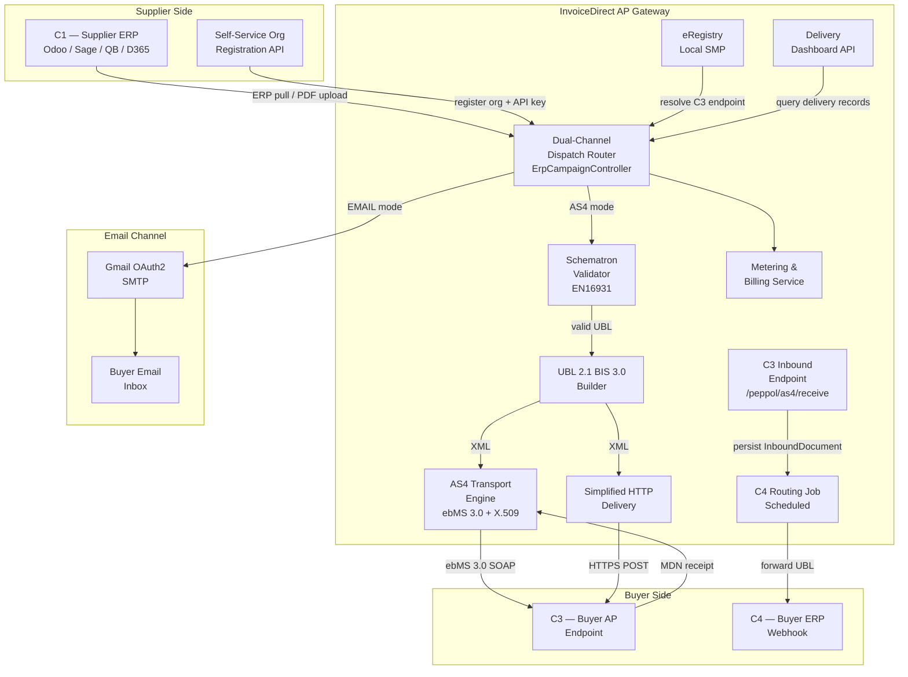
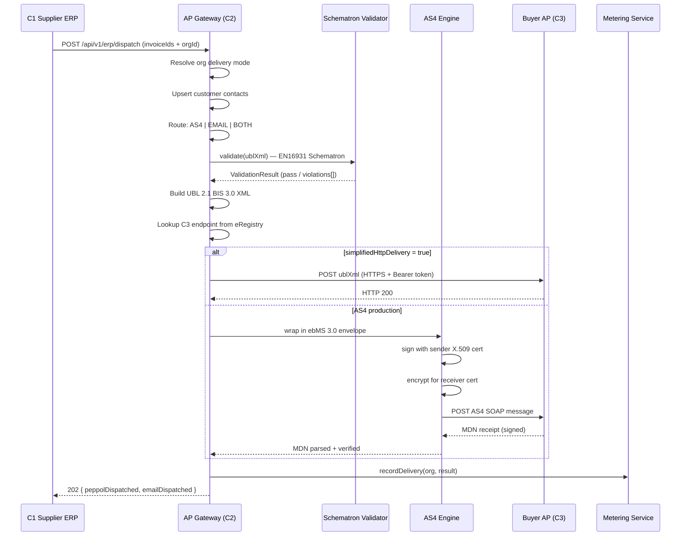
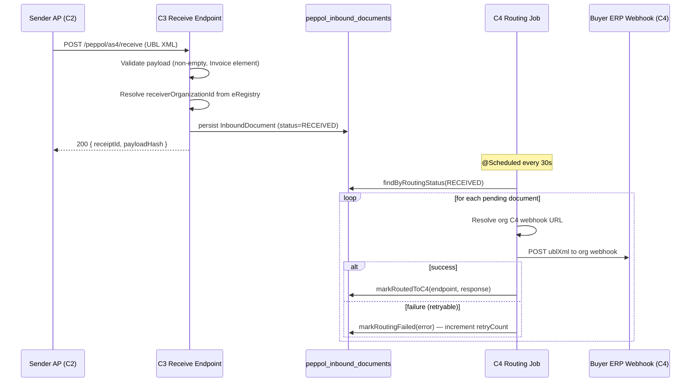
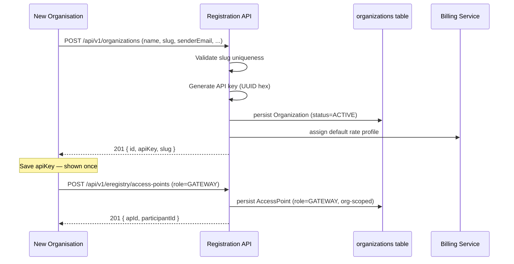

# Design Document: Access Point Gateway

## Overview

The Access Point Gateway is the core product of the InvoiceDirect platform — a multi-tenant PEPPOL-compliant invoice delivery network for Zimbabwe. It enables organisations (suppliers) to self-register, connect their ERP, and dispatch fiscalised invoices to buyers via two channels: PDF email and PEPPOL BIS 3.0 UBL XML. The gateway implements the full PEPPOL 4-corner model: acting as C2 (sender AP) for outbound delivery and C3 (receiver AP) for inbound document receipt, with C4 routing forwarding received documents to buyer ERPs.

The platform already has a solid foundation — `AccessPoint`, `PeppolParticipantLink`, `InboundDocument`, `PeppolDeliveryRecord`, `PeppolDeliveryService`, `UblInvoiceBuilder`, `ERegistryController`, and `PeppolReceiveController` are all in place. This spec covers the gaps: full AS4 transport, C4 routing job, Schematron validation, participant link management UI, self-service org registration, and the delivery dashboard.

## Architecture



## Sequence Diagrams

### Outbound Invoice Dispatch (PEPPOL Channel)



### Inbound Document Receipt and C4 Routing



### Organisation Self-Service Onboarding



## Components and Interfaces

### Component 1: Organisation Self-Registration API

**Purpose**: Allows companies to self-register on the gateway, receive an API key, and configure their PEPPOL identity without admin intervention.

**Interface** (new endpoint — `OrganizationController`):
```java
// POST /api/v1/organizations
record RegisterOrgRequest(
    @NotBlank String name,
    @NotBlank String slug,           // globally unique, URL-safe
    @NotBlank String senderEmail,
    @NotBlank String senderDisplayName,
    String accountsEmail,
    String companyAddress,
    String primaryErpSource,         // SAGE_INTACCT | QUICKBOOKS_ONLINE | DYNAMICS_365 | ODOO | GENERIC_API
    String erpTenantId,
    String vatNumber,                // Zimbabwe VAT → derives peppolParticipantId 0190:ZW{vat}
    String tinNumber,                // fallback if no VAT
    DeliveryMode deliveryMode        // EMAIL | AS4 | BOTH (default: EMAIL)
)

record RegisterOrgResponse(
    UUID id,
    String slug,
    String apiKey,                   // shown once — must be saved by caller
    String peppolParticipantId,      // derived: 0190:ZW{vatNumber}
    String status
)

// GET /api/v1/organizations/by-slug/{slug}
// GET /api/v1/organizations/{id}
// PATCH /api/v1/organizations/{id}/rate-profile  { rateProfileId }
// PATCH /api/v1/organizations/{id}/delivery-mode { deliveryMode }
```

**Responsibilities**:
- Validate slug uniqueness before persisting
- Generate cryptographically random API key (UUID hex, 32 chars)
- Derive `peppolParticipantId` from `vatNumber` or `tinNumber` using scheme `0190:ZW{id}`
- Assign default rate profile if one is configured as the platform default
- Return API key in the 201 response body only — never again

---

### Component 2: AS4 Transport Engine

**Purpose**: Implements full PEPPOL AS4 transport (ebMS 3.0) with X.509 message signing, encryption, and MDN receipt handling. Replaces the current `UnsupportedOperationException` placeholder in `PeppolDeliveryService.transmitAs4()`.

**Interface**:
```java
interface As4TransportClient {
    As4DeliveryResult send(As4Message message);
}

record As4Message(
    String senderParticipantId,
    String receiverParticipantId,
    String documentTypeId,
    String processId,
    String ublXmlPayload,
    X509Certificate senderCert,
    PrivateKey senderPrivateKey,
    X509Certificate receiverCert,
    String receiverEndpointUrl
)

record As4DeliveryResult(
    boolean success,
    String mdnMessageId,
    String mdnStatus,           // "processed" | "failed"
    String rawMdnResponse,
    String errorDescription     // null on success
)
```

**Responsibilities**:
- Wrap UBL XML in ebMS 3.0 SOAP envelope with correct `eb:Messaging` header
- Sign the SOAP message using sender's X.509 private key (WSS4J / xmlsec)
- Encrypt payload for receiver's public certificate
- POST to receiver's AS4 endpoint URL
- Parse and verify the MDN (Message Disposition Notification) response
- Throw `As4TransportException` on non-2xx or invalid MDN

---

### Component 3: Schematron Validator

**Purpose**: Validates UBL 2.1 XML against PEPPOL EN16931 Schematron rules before transmission, catching business rule violations before they reach the receiver's AP.

**Interface**:
```java
interface SchematronValidator {
    SchematronResult validate(String ublXml, String profileId);
}

record SchematronResult(
    boolean valid,
    List<SchematronViolation> violations
)

record SchematronViolation(
    String ruleId,      // e.g. "BR-01", "BR-CO-15"
    String severity,    // "fatal" | "warning"
    String message,
    String location     // XPath location in the document
)
```

**Responsibilities**:
- Load EN16931 Schematron rules from classpath (`/schematron/PEPPOL-EN16931-UBL.sch`)
- Transform rules to XSLT using Saxon or Schematron4J
- Execute validation against the UBL document
- Return all violations with severity — block transmission on any `fatal` violation
- Cache compiled XSLT transforms (rules don't change at runtime)

---

### Component 4: C4 Routing Job

**Purpose**: Scheduled job that polls `InboundDocument` records in `RECEIVED` status and forwards them to the receiving organisation's configured ERP webhook endpoint.

**Interface**:
```java
@Component
class PeppolC4RoutingJob {
    @Scheduled(fixedDelay = 30_000)
    void routePendingDocuments();
}

// Organisation C4 webhook config (new field on Organization)
// Organization.c4WebhookUrl — the ERP endpoint to POST inbound UBL to
// Organization.c4WebhookAuthToken — Bearer token for the webhook
```

**Responsibilities**:
- Query `InboundDocument` where `routingStatus = RECEIVED` (batch size 50)
- For each document, resolve the receiver org's `c4WebhookUrl`
- POST the UBL XML to the webhook with `Authorization: Bearer {token}`
- On HTTP 2xx: call `doc.markRoutedToC4(endpoint, response)`
- On failure: call `doc.markRoutingFailed(error)` — retry up to 3 times with exponential backoff
- Skip documents where `routingRetryCount >= 3` (mark as permanently failed, alert)
- Use `@Transactional` per document to avoid partial batch commits

---

### Component 5: Participant Link Management UI

**Purpose**: React frontend tab in `PeppolPage.tsx` for suppliers to link their customers to PEPPOL participant IDs and receiver Access Points.

**Interface** (new tab in `PeppolPage.tsx`):
```typescript
interface ParticipantLink {
  id: string
  organizationId: string
  customerContactId: string
  customerEmail: string        // denormalised for display
  participantId: string        // e.g. "0190:ZW987654321"
  receiverAccessPointId: string
  receiverApName: string       // denormalised for display
  preferredChannel: 'PEPPOL' | 'EMAIL'
  createdAt: string
}

// API calls (new in client.ts)
listParticipantLinks(orgId: string): Promise<ParticipantLink[]>
createParticipantLink(req: CreateParticipantLinkRequest): Promise<ParticipantLink>
deleteParticipantLink(id: string): Promise<void>
```

**Responsibilities**:
- New "Participant Links" tab alongside "Access Points", "Delivery History", "Inbound Inbox"
- Table showing all links for the current org with customer email, participant ID, AP name, channel
- "Link Customer" modal: customer email lookup → participant ID input → AP selector → channel toggle
- Delete link with confirmation
- Inline validation: participant ID format `{scheme}:{value}`, AP must exist in eRegistry

---

### Component 6: Delivery Dashboard

**Purpose**: Per-organisation view of PEPPOL delivery statistics, success rates, and failed deliveries with retry capability.

**Interface** (new endpoint `OrgDeliveryDashboardController`):
```java
// GET /api/v1/dashboard/{orgId}/peppol-stats
record PeppolDeliveryStats(
    long totalDispatched,
    long delivered,
    long failed,
    long retrying,
    double successRate,          // delivered / totalDispatched * 100
    String currentPeriod,
    List<DailyDeliveryCount> dailyTrend  // last 30 days
)

// GET /api/v1/dashboard/{orgId}/failed-deliveries
// POST /api/v1/dashboard/{orgId}/retry/{deliveryRecordId}
```

**Responsibilities**:
- Aggregate `PeppolDeliveryRecord` counts by status for the org
- Compute 30-day daily trend from `createdAt` timestamps
- Expose retry endpoint that re-queues a `FAILED` delivery record
- Frontend: new `DeliveryDashboard` tab in org-facing `DashboardPage.tsx`

## Data Models

### Model 1: Organization (existing — additions)

```java
// New fields to add to Organization entity
String c4WebhookUrl;          // ERP webhook for inbound C4 routing
String c4WebhookAuthToken;    // Bearer token for C4 webhook auth
```

**Validation Rules**:
- `c4WebhookUrl` must be a valid HTTPS URL when set
- `c4WebhookAuthToken` stored encrypted at rest (AES-256)

---

### Model 2: AccessPoint (existing — no changes needed)

```java
// Key fields already present:
UUID id
UUID organizationId           // null for external APs
String participantId          // "0190:ZW123456789"
AccessPointRole role          // SENDER | RECEIVER | GATEWAY
String endpointUrl
boolean simplifiedHttpDelivery
String deliveryAuthToken
String certificate            // X.509 PEM for AS4
AccessPointStatus status      // ACTIVE | SUSPENDED | DECOMMISSIONED
```

---

### Model 3: PeppolParticipantLink (existing — no changes needed)

```java
UUID organizationId
UUID customerContactId
String participantId          // buyer's PEPPOL ID
UUID receiverAccessPointId    // FK → AccessPoint
DeliveryChannel preferredChannel  // PEPPOL | EMAIL
```

---

### Model 4: PeppolDeliveryRecord (existing — additions)

```java
// New fields for AS4 MDN tracking
String mdnMessageId;          // AS4 MDN message ID
String mdnStatus;             // "processed" | "failed" | null (HTTP delivery)
boolean schematronPassed;     // was Schematron validation run and passed?
List<String> schematronWarnings;  // non-fatal violations (stored as JSON)
```

---

### Model 5: InboundDocument (existing — no changes needed)

```java
// Lifecycle: RECEIVED → ROUTING → DELIVERED_TO_C4 | ROUTING_FAILED
RoutingStatus routingStatus
String routedToEndpoint       // C4 webhook URL
int routingRetryCount         // max 3 before permanent failure
```

---

### Model 6: SchematronViolation (new — value object, not persisted)

```java
record SchematronViolation(
    String ruleId,
    String severity,    // "fatal" | "warning"
    String message,
    String location
)
```

**Validation Rules**:
- Any `fatal` violation blocks transmission
- `warning` violations are logged and stored on `PeppolDeliveryRecord.schematronWarnings`

## Algorithmic Pseudocode

### Main Outbound Delivery Algorithm

```pascal
ALGORITHM deliverViaPeppol(organizationId, invoice)
INPUT:  organizationId: UUID, invoice: CanonicalInvoice
OUTPUT: PeppolDeliveryRecord

BEGIN
  ASSERT organizationId ≠ null AND invoice ≠ null

  // Step 1: Resolve supplier
  supplier ← orgRepo.findById(organizationId)
  IF supplier = null THEN
    THROW PeppolRoutingException("Organization not found")
  END IF

  // Step 2: Resolve buyer contact
  buyer ← customerRepo.findByOrgAndEmail(organizationId, invoice.recipientEmail)
  IF buyer = null THEN
    THROW PeppolRoutingException("Customer contact not found")
  END IF

  // Step 3: Resolve participant link
  link ← linkRepo.findByOrgAndCustomer(organizationId, buyer.id)
  IF link = null THEN
    THROW PeppolRoutingException("No PEPPOL participant link")
  END IF

  // Step 4: Resolve receiver AP
  receiverAp ← apRepo.findById(link.receiverAccessPointId)
  IF receiverAp = null OR NOT receiverAp.isActive() THEN
    THROW PeppolRoutingException("Receiver AP not found or inactive")
  END IF

  // Step 5: Build UBL XML
  ublXml ← ublBuilder.build(invoice, supplier)

  // Step 6: Schematron validation
  schematronResult ← schematronValidator.validate(ublXml, PROFILE_ID)
  IF schematronResult.hasFatalViolations() THEN
    THROW SchematronValidationException(schematronResult.violations)
  END IF

  // Step 7: Create delivery record (TRANSMITTING)
  record ← PeppolDeliveryRecord.builder()
              .organizationId(organizationId)
              .invoiceNumber(invoice.invoiceNumber)
              .senderParticipantId(resolveSenderParticipantId(organizationId, supplier))
              .receiverParticipantId(link.participantId)
              .deliveredToEndpoint(receiverAp.endpointUrl)
              .schematronPassed(true)
              .schematronWarnings(schematronResult.warnings)
              .status(TRANSMITTING)
              .build()
  deliveryRepo.save(record)

  // Step 8: Transmit
  TRY
    IF receiverAp.simplifiedHttpDelivery THEN
      transmitHttp(receiverAp, ublXml, invoice.invoiceNumber)
      record.markDelivered("HTTP 200 OK")
    ELSE
      mdnResult ← as4Client.send(buildAs4Message(record, receiverAp, ublXml))
      IF mdnResult.success THEN
        record.markDelivered(mdnResult.mdnMessageId)
        record.mdnStatus ← mdnResult.mdnStatus
      ELSE
        THROW As4TransportException(mdnResult.errorDescription)
      END IF
    END IF
  CATCH exception
    record.markFailed(exception.message)
    LOG.error("PEPPOL delivery failed: invoice={} → {}: {}", ...)
  END TRY

  RETURN deliveryRepo.save(record)
END
```

**Preconditions:**
- `organizationId` references an existing, active Organization
- `invoice.recipientEmail` is non-null and non-blank
- A `PeppolParticipantLink` exists for the (org, customer) pair
- The linked `AccessPoint` is in `ACTIVE` status

**Postconditions:**
- A `PeppolDeliveryRecord` is persisted regardless of transmission outcome
- `record.status` is either `DELIVERED` or `FAILED`
- If `DELIVERED` and AS4: `record.mdnMessageId` is non-null
- Schematron warnings are stored on the record even on success

**Loop Invariants:** N/A (no loops in main path)

---

### C4 Routing Job Algorithm

```pascal
ALGORITHM routePendingDocuments()
INPUT:  none (reads from DB)
OUTPUT: none (side effects: updates InboundDocument records)

BEGIN
  ASSERT scheduledJob IS running

  // Fetch batch of pending documents
  pending ← inboundRepo.findByRoutingStatus(RECEIVED, limit=50)

  FOR each doc IN pending DO
    ASSERT doc.routingStatus = RECEIVED
    ASSERT doc.routingRetryCount < MAX_RETRIES (3)

    // Resolve C4 webhook
    org ← orgRepo.findById(doc.receiverOrganizationId)
    IF org = null OR org.c4WebhookUrl = null THEN
      LOG.warn("No C4 webhook for org {}", doc.receiverOrganizationId)
      CONTINUE
    END IF

    // Mark as routing (optimistic lock)
    doc.routingStatus ← ROUTING
    inboundRepo.save(doc)

    TRY
      response ← httpClient.post(
        url   = org.c4WebhookUrl,
        body  = doc.ublXmlPayload,
        token = org.c4WebhookAuthToken
      )
      IF response.statusCode IS 2xx THEN
        doc.markRoutedToC4(org.c4WebhookUrl, response.body)
      ELSE
        THROW C4RoutingException("Non-2xx: " + response.statusCode)
      END IF
    CATCH exception
      doc.markRoutingFailed(exception.message)
      IF doc.routingRetryCount >= MAX_RETRIES THEN
        LOG.error("C4 routing permanently failed for doc {}", doc.id)
        // TODO: alert / dead-letter queue
      END IF
    END TRY

    inboundRepo.save(doc)
  END FOR
END
```

**Preconditions:**
- Job runs every 30 seconds via `@Scheduled(fixedDelay = 30_000)`
- Each document is processed in its own `@Transactional(REQUIRES_NEW)` scope

**Postconditions:**
- Each processed document transitions to `DELIVERED_TO_C4` or `ROUTING_FAILED`
- Documents with `routingRetryCount >= 3` are not retried (permanent failure)

**Loop Invariants:**
- All documents processed in a batch were in `RECEIVED` status at query time
- `routingRetryCount` is monotonically non-decreasing per document

---

### Schematron Validation Algorithm

```pascal
ALGORITHM validateUbl(ublXml, profileId)
INPUT:  ublXml: String, profileId: String
OUTPUT: SchematronResult

BEGIN
  ASSERT ublXml ≠ null AND ublXml IS valid XML

  // Load compiled XSLT (cached after first load)
  xslt ← schematronCache.getOrCompile(profileId)

  // Execute transformation
  svrlOutput ← xslt.transform(ublXml)

  // Parse SVRL (Schematron Validation Report Language) output
  violations ← []
  FOR each failedAssert IN svrlOutput.failedAsserts DO
    violations.add(SchematronViolation(
      ruleId   = failedAssert.id,
      severity = failedAssert.role,   // "fatal" | "warning"
      message  = failedAssert.text,
      location = failedAssert.location
    ))
  END FOR

  hasFatal ← violations.any(v → v.severity = "fatal")
  RETURN SchematronResult(valid = NOT hasFatal, violations = violations)
END
```

**Preconditions:**
- `ublXml` is well-formed XML
- Schematron rules file exists at `/schematron/PEPPOL-EN16931-UBL.sch`

**Postconditions:**
- Returns `valid=true` only if zero fatal violations
- All violations (fatal + warning) are included in the result
- XSLT transform is cached — subsequent calls do not recompile

**Loop Invariants:**
- All `failedAsserts` in SVRL output are processed exactly once

## Key Functions with Formal Specifications

### `PeppolDeliveryService.deliver(UUID organizationId, CanonicalInvoice invoice)`

```java
@Transactional
public PeppolDeliveryRecord deliver(UUID organizationId, CanonicalInvoice invoice)
```

**Preconditions:**
- `organizationId` is non-null and references an `Organization` with `status=ACTIVE`
- `invoice.recipientEmail()` is non-null, non-blank, and matches a `CustomerContact` in the org
- A `PeppolParticipantLink` exists for `(organizationId, customerContact.id)`
- The linked `AccessPoint` has `status=ACTIVE`
- `invoice.invoiceNumber()` is non-null and non-blank

**Postconditions:**
- A `PeppolDeliveryRecord` is persisted with `organizationId`, `invoiceNumber`, `senderParticipantId`, `receiverParticipantId`
- If transmission succeeds: `record.status = DELIVERED`, `record.acknowledgedAt` is set
- If transmission fails: `record.status = FAILED`, `record.errorMessage` is non-null, `record.retryCount` incremented
- `record.ublXmlPayload` contains the transmitted UBL XML (for audit/resend)
- Metering is NOT called here — caller (`ErpCampaignController`) is responsible

**Loop Invariants:** N/A

---

### `SchematronValidatorImpl.validate(String ublXml, String profileId)`

```java
public SchematronResult validate(String ublXml, String profileId)
```

**Preconditions:**
- `ublXml` is non-null, non-blank, and well-formed XML
- `profileId` is one of the known PEPPOL profile IDs (e.g. `urn:fdc:peppol.eu:2017:poacc:billing:01:1.0`)

**Postconditions:**
- Returns `SchematronResult` with `valid=true` iff zero fatal violations
- `result.violations` contains all failed assertions (fatal + warning)
- XSLT transform for `profileId` is cached after first invocation
- No mutations to `ublXml` or any persistent state

**Loop Invariants:**
- For each `failedAssert` in SVRL: exactly one `SchematronViolation` is added to result

---

### `PeppolC4RoutingJob.routePendingDocuments()`

```java
@Scheduled(fixedDelay = 30_000)
@Transactional(propagation = REQUIRES_NEW)
public void routePendingDocuments()
```

**Preconditions:**
- Spring context is fully initialised
- `inboundRepo`, `orgRepo`, `httpClient` are injected and non-null

**Postconditions:**
- All `InboundDocument` records with `routingStatus=RECEIVED` and `routingRetryCount < 3` are attempted
- Each document transitions to `DELIVERED_TO_C4` or `ROUTING_FAILED`
- Documents with `routingRetryCount >= 3` remain `ROUTING_FAILED` and are not retried
- Each document's state change is committed in its own transaction

**Loop Invariants:**
- `routingRetryCount` for any document is non-decreasing across job executions
- A document in `DELIVERED_TO_C4` is never re-processed

---

### `As4TransportClientImpl.send(As4Message message)`

```java
public As4DeliveryResult send(As4Message message)
```

**Preconditions:**
- `message.ublXmlPayload` is non-null and valid UBL XML
- `message.senderCert` and `message.senderPrivateKey` are non-null and form a valid key pair
- `message.receiverCert` is non-null (for encryption)
- `message.receiverEndpointUrl` is a valid HTTPS URL

**Postconditions:**
- If receiver returns HTTP 200 with valid MDN: `result.success=true`, `result.mdnMessageId` non-null
- If receiver returns non-2xx or invalid MDN: `result.success=false`, `result.errorDescription` non-null
- The SOAP envelope is signed with sender's private key (verifiable by receiver)
- The payload is encrypted for receiver's public key (only receiver can decrypt)

**Loop Invariants:** N/A

---

### `OrganizationService.register(RegisterOrgRequest request)`

```java
@Transactional
public RegisterOrgResponse register(RegisterOrgRequest request)
```

**Preconditions:**
- `request.slug` is non-null, matches `[a-z0-9-]+`, and does not exist in `organizations` table
- `request.senderEmail` is a valid email address
- `request.name` is non-blank

**Postconditions:**
- An `Organization` is persisted with `status=ACTIVE`, `createdAt=now()`
- `apiKey` is a 32-character hex string, unique across all organizations
- `peppolParticipantId` is derived as `0190:ZW{vatNumber}` if `vatNumber` is non-null, else `0190:ZW{tinNumber}` if non-null, else null
- The `apiKey` is returned in the response and is not stored in plaintext (hashed in DB — or returned once and stored as-is per current pattern)
- `deliveryMode` defaults to `EMAIL` if not specified

**Loop Invariants:** N/A

## Example Usage

### Register an Organisation and Dispatch via PEPPOL

```java
// 1. Register org (self-service)
POST /api/v1/organizations
{
  "name": "Acme Holdings (Pvt) Ltd",
  "slug": "acme-holdings",
  "senderEmail": "noreply@acmeholdings.co.zw",
  "senderDisplayName": "Acme Holdings Accounts",
  "vatNumber": "12345678",
  "deliveryMode": "BOTH"
}
// Response: { "id": "...", "apiKey": "9ca22fce...", "peppolParticipantId": "0190:ZW12345678" }

// 2. Register own gateway AP (C2)
POST /api/v1/eregistry/access-points
{
  "organizationId": "acme-org-uuid",
  "participantId": "0190:ZW12345678",
  "participantName": "Acme Holdings AP Gateway",
  "role": "GATEWAY",
  "endpointUrl": "https://ap.invoicedirect.biz/peppol/as4/receive",
  "simplifiedHttpDelivery": true
}

// 3. Register buyer's AP (C3)
POST /api/v1/eregistry/access-points
{
  "participantId": "0190:ZW987654321",
  "participantName": "Client Company Ltd",
  "role": "RECEIVER",
  "endpointUrl": "https://erp.clientcompany.co.zw/peppol/receive",
  "simplifiedHttpDelivery": true,
  "deliveryAuthToken": "buyer-bearer-token"
}

// 4. Link customer to their AP
POST /api/v1/eregistry/participant-links
{
  "organizationId": "acme-org-uuid",
  "customerContactId": "customer-uuid",
  "participantId": "0190:ZW987654321",
  "receiverAccessPointId": "receiver-ap-uuid",
  "preferredChannel": "PEPPOL"
}

// 5. Dispatch invoice — automatically routes to PEPPOL
POST /api/v1/erp/dispatch/upload
// (multipart with PDF + metadata)
// Response: { "peppolDispatched": 1, "emailDispatched": 0 }
```

### Inbound Document Receipt and C4 Routing

```java
// External AP sends document to our C3 endpoint
POST /peppol/as4/receive
Content-Type: application/xml
X-PEPPOL-Sender-ID: 0190:ZW111111111
X-PEPPOL-Receiver-ID: 0190:ZW12345678
// Body: UBL 2.1 Invoice XML

// Response: { "receiptId": "uuid", "payloadHash": "sha256hex", "status": "received" }

// 30 seconds later, C4 routing job fires:
// → finds InboundDocument with routingStatus=RECEIVED
// → resolves org.c4WebhookUrl = "https://erp.acmeholdings.co.zw/invoices/inbound"
// → POSTs UBL XML to webhook
// → marks document DELIVERED_TO_C4
```

### Schematron Validation Failure

```java
// UBL missing mandatory BR-04 (invoice number)
SchematronResult result = validator.validate(ublXml, PROFILE_ID);
// result.valid = false
// result.violations = [
//   SchematronViolation(ruleId="BR-04", severity="fatal",
//     message="[BR-04]-An Invoice shall have an Invoice number.",
//     location="/Invoice/cbc:ID")
// ]
// → PeppolDeliveryService throws SchematronValidationException
// → PeppolDeliveryRecord persisted with status=FAILED, errorMessage="BR-04: ..."
```

### AS4 Full Transport

```java
// Production AS4 delivery (simplifiedHttpDelivery=false)
As4Message msg = new As4Message(
    senderParticipantId,
    receiverParticipantId,
    DOCUMENT_TYPE_ID,
    PROFILE_ID,
    ublXml,
    senderCert,
    senderPrivateKey,
    receiverCert,
    "https://erp.clientcompany.co.zw/as4/receive"
);
As4DeliveryResult result = as4Client.send(msg);
// result.success = true
// result.mdnMessageId = "msg-id-from-mdn"
// result.mdnStatus = "processed"
```

## Correctness Properties

*A property is a characteristic or behavior that should hold true across all valid executions of a system — essentially, a formal statement about what the system should do. Properties serve as the bridge between human-readable specifications and machine-verifiable correctness guarantees.*

### Property 1: Delivery Audit Completeness

*For any* invocation of `PeppolDeliveryService.deliver()`, a `PeppolDeliveryRecord` is persisted regardless of whether transmission succeeds or fails. No invoice transmission attempt is unrecorded.

```
∀ invoice ∈ dispatched_via_peppol:
  ∃ record ∈ peppol_delivery_records WHERE record.invoiceNumber = invoice.invoiceNumber
  AND record.status ∈ {DELIVERED, FAILED}
```

**Validates: Requirements 7.9**

---

### Property 2: Schematron Gate

*For any* UBL document where Schematron validation produces at least one fatal violation, no HTTP or AS4 request is made to the receiver endpoint. Transmission is blocked before any network call.

```
∀ ublXml: schematronResult.hasFatalViolations() = true
  ⟹ no HTTP/AS4 request is made to receiverAp.endpointUrl
```

**Validates: Requirements 6.4**

---

### Property 3: C4 Routing Idempotency

*For any* inbound document with `routingStatus=DELIVERED_TO_C4`, the C4 routing job never selects or re-processes that document. Each inbound document is forwarded to C4 at most once.

```
∀ doc ∈ peppol_inbound_documents:
  doc.routingStatus = DELIVERED_TO_C4
  ⟹ doc is never selected by routePendingDocuments()
```

**Validates: Requirements 10.7**

---

### Property 4: Retry Bound

*For any* inbound document, the C4 routing job never retries it more than 3 times. Documents with `routingRetryCount >= 3` are permanently marked `ROUTING_FAILED` and not re-queued.

```
∀ doc ∈ peppol_inbound_documents:
  doc.routingRetryCount ≥ 3
  ⟹ doc.routingStatus = ROUTING_FAILED
  AND doc is not selected for further routing attempts
```

**Validates: Requirements 10.6**

---

### Property 5: API Key Uniqueness

*For any* two registered organisations with different IDs, their API keys are distinct. No two organisations share the same API key.

```
∀ org1, org2 ∈ organizations WHERE org1.id ≠ org2.id:
  org1.apiKey ≠ org2.apiKey
```

**Validates: Requirements 1.3, 15.3**

---

### Property 6: Participant ID Derivation Consistency

*For any* organisation with a non-null `vatNumber`, the derived `peppolParticipantId` always equals `0190:ZW{vatNumber}`. For any organisation with no `vatNumber` but a non-null `tinNumber`, the derived ID equals `0190:ZW{tinNumber}`.

```
∀ org ∈ organizations WHERE org.vatNumber ≠ null:
  org.peppolParticipantId = "0190:ZW" + org.vatNumber

∀ org ∈ organizations WHERE org.vatNumber = null AND org.tinNumber ≠ null:
  org.peppolParticipantId = "0190:ZW" + org.tinNumber
```

**Validates: Requirements 1.4, 1.5**

---

### Property 7: Delivery Mode Routing Correctness

*For any* invoice and its effective delivery mode (resolved from customer override or org default), the routing decision must exactly match: `AS4` → PEPPOL only, `EMAIL` → email only, `BOTH` → both channels.

```
∀ invoice ∈ dispatched:
  effectiveDeliveryMode(invoice) = AS4  ⟹ invoice ∈ peppolInvoices AND invoice ∉ emailInvoices
  effectiveDeliveryMode(invoice) = EMAIL ⟹ invoice ∈ emailInvoices AND invoice ∉ peppolInvoices
  effectiveDeliveryMode(invoice) = BOTH  ⟹ invoice ∈ peppolInvoices AND invoice ∈ emailInvoices
```

**Validates: Requirements 4.1, 4.2, 4.3, 4.4**

---

### Property 8: MDN Verification (AS4)

*For any* PEPPOL delivery record where AS4 transport was used, the record is only marked `DELIVERED` if the MDN receipt was received with `status=processed` and a non-null `mdnMessageId`. An absent or failed MDN results in `FAILED` status.

```
∀ record ∈ peppol_delivery_records WHERE record.simplifiedHttp = false:
  record.status = DELIVERED
  ⟹ record.mdnStatus = "processed" AND record.mdnMessageId ≠ null
```

**Validates: Requirements 8.4, 8.6**

---

### Property 9: UBL Monetary Total Invariant

*For any* `CanonicalInvoice` with `subtotalAmount` and `vatAmount`, the UBL document produced by the UBL_Builder always has `PayableAmount = subtotalAmount + vatAmount`.

```
∀ invoice ∈ CanonicalInvoice:
  parse(ublBuilder.build(invoice)).PayableAmount = invoice.subtotalAmount + invoice.vatAmount
```

**Validates: Requirements 5.3**

---

### Property 10: UBL Round-Trip

*For any* valid `CanonicalInvoice`, building a UBL document, parsing it back to a canonical form, and building again produces an equivalent UBL document.

```
∀ invoice ∈ CanonicalInvoice:
  ublBuilder.build(parse(ublBuilder.build(invoice))) ≡ ublBuilder.build(invoice)
```

**Validates: Requirements 5.7**

---

### Property 11: Schematron Idempotency

*For any* well-formed UBL XML input, invoking the Schematron_Validator twice with the same input returns equivalent `SchematronResult` values.

```
∀ ublXml ∈ well-formed XML:
  schematronValidator.validate(ublXml, profileId) ≡ schematronValidator.validate(ublXml, profileId)
```

**Validates: Requirements 6.7**

---

### Property 12: Payload Hash Correctness

*For any* inbound UBL XML payload, the `payloadHash` stored on the `InboundDocument` record equals the SHA-256 hex digest of that payload.

```
∀ payload ∈ received_ubl_payloads:
  inboundDocument.payloadHash = sha256hex(payload)
```

**Validates: Requirements 9.5**

---

### Property 13: Success Rate Formula

*For any* organisation's delivery statistics, `successRate = (delivered / totalDispatched) * 100` when `totalDispatched > 0`, and `successRate = 0` when `totalDispatched = 0`.

```
∀ stats ∈ PeppolDeliveryStats:
  totalDispatched > 0 ⟹ stats.successRate = (stats.delivered / stats.totalDispatched) * 100
  totalDispatched = 0 ⟹ stats.successRate = 0
```

**Validates: Requirements 11.2**

---

### Property 14: Data Isolation

*For any* authenticated organisation, all queries for customers, delivery records, and campaigns return only records scoped to that organisation's ID. No cross-tenant data leakage occurs.

```
∀ orgId ∈ authenticated_orgs, ∀ record ∈ query_results(orgId):
  record.organizationId = orgId
```

**Validates: Requirements 15.2**

---

### Property 15: ZIMRA Fiscal Gate

*For any* invoice dispatched via the PEPPOL channel, the dispatch is only permitted when the invoice has a non-null `fiscalMetadata` with a non-blank `verificationCode`. An invoice without a valid verification code is rejected before any UBL document is built or any delivery record is persisted.

```
∀ invoice ∈ peppol_dispatched:
  invoice.fiscalMetadata ≠ null AND invoice.fiscalMetadata.verificationCode ≠ blank
```

**Validates: Requirements 16.1, 16.2**

---

### Property 16: Inbound Sender Authenticity

*For any* inbound document received at the C3 endpoint, the document is only persisted when the `X-PEPPOL-Sender-ID` header matches a known `AccessPoint` in the eRegistry. Documents from unknown senders are rejected without persisting any record.

```
∀ inboundRequest:
  inboundRequest.senderParticipantId ∉ eRegistry.knownParticipantIds
  ⟹ no InboundDocument is persisted AND response.status = 403
```

**Validates: Requirements 9.6**

## Error Handling

### Error Scenario 1: No PEPPOL Participant Link

**Condition**: `PeppolDeliveryService.deliver()` is called for a customer with no `PeppolParticipantLink`.
**Response**: Throws `PeppolRoutingException("No PEPPOL participant link for customer: {email}")`. The `ErpCampaignController` catches this, logs it, and records `status=FAILED` in the dispatch summary.
**Recovery**: Operator registers the participant link via `POST /api/v1/eregistry/participant-links`, then retries the delivery via the dashboard retry endpoint.

### Error Scenario 2: Schematron Validation Failure

**Condition**: UBL XML fails EN16931 Schematron rules (e.g. missing mandatory field BR-04).
**Response**: `SchematronValidationException` thrown with violation list. `PeppolDeliveryRecord` persisted with `status=FAILED`, `errorMessage` contains the rule IDs and messages.
**Recovery**: Fix the UBL generation (update `UblInvoiceBuilder`) and re-dispatch. The delivery record's `ublXmlPayload` is stored for debugging.

### Error Scenario 3: AS4 MDN Failure

**Condition**: Receiver AP returns a non-2xx response or an MDN with `status=failed`.
**Response**: `As4TransportException` thrown. `PeppolDeliveryRecord.markFailed()` called with MDN error detail.
**Recovery**: Dashboard retry endpoint re-queues the delivery. The stored `ublXmlPayload` is re-transmitted without rebuilding the UBL.

### Error Scenario 4: C4 Routing Webhook Unreachable

**Condition**: Buyer's ERP webhook returns non-2xx or times out during C4 routing.
**Response**: `InboundDocument.markRoutingFailed()` called. Job retries on next execution (30s interval) up to 3 times with exponential backoff (30s, 60s, 120s).
**Recovery**: After 3 failures, document is permanently `ROUTING_FAILED`. Admin is alerted. Manual re-trigger available via admin API.

### Error Scenario 5: Duplicate Organisation Slug

**Condition**: `POST /api/v1/organizations` with a slug that already exists.
**Response**: HTTP 409 Conflict with body `{ "error": "Slug already registered: {slug}" }`.
**Recovery**: Caller chooses a different slug.

### Error Scenario 6: Receiver AP Suspended

**Condition**: `PeppolDeliveryService.deliver()` resolves an AP with `status=SUSPENDED`.
**Response**: `PeppolRoutingException("Receiver Access Point is not active")`. Delivery record persisted as `FAILED`.
**Recovery**: Admin reactivates the AP via `PATCH /api/v1/eregistry/access-points/{id}/status?status=ACTIVE`.

## Testing Strategy

### Unit Testing Approach

- `UblInvoiceBuilderTest`: assert CustomizationID, ProfileID, VAT breakdown, monetary totals, ZIMRA note presence for various `CanonicalInvoice` inputs
- `SchematronValidatorTest`: test against known-good and known-bad UBL documents; assert fatal violations block, warnings pass
- `PeppolDeliveryServiceTest`: mock `apRepo`, `linkRepo`, `ublBuilder`, `as4Client`; verify record lifecycle transitions
- `PeppolC4RoutingJobTest`: mock `inboundRepo`, `orgRepo`, `httpClient`; verify retry count increments, max-retry guard, DELIVERED_TO_C4 idempotency
- `OrganizationServiceTest`: verify slug uniqueness check, API key generation, participant ID derivation

### Property-Based Testing Approach

**Property Test Library**: `junit-quickcheck` (Java) or `jqwik`

- **UBL monetary totals**: for any `(subtotal, vatAmount)` pair where `total = subtotal + vatAmount`, the built UBL XML always has `PayableAmount = subtotal + vatAmount`
- **Participant ID derivation**: for any non-blank `vatNumber` string, `deriveParticipantId(vatNumber)` always returns a string matching `^0190:ZW.+$`
- **Schematron idempotency**: validating the same UBL XML twice always returns the same `SchematronResult`
- **Retry bound**: for any sequence of C4 routing failures, `routingRetryCount` never exceeds 3 and the document is never re-queued after reaching the limit

### Integration Testing Approach

- `PeppolDeliveryIntegrationTest`: spin up H2 in-memory DB, wire real `PeppolDeliveryService` + `UblInvoiceBuilder`, mock HTTP endpoint with MockServer; assert end-to-end delivery record lifecycle
- `C4RoutingJobIntegrationTest`: persist `InboundDocument` records, run job, assert status transitions and webhook calls via MockServer
- `OrganizationRegistrationIntegrationTest`: full `POST /api/v1/organizations` → `POST /api/v1/eregistry/access-points` → `POST /api/v1/erp/dispatch` flow

## Performance Considerations

- **C4 Routing Job batch size**: capped at 50 documents per execution to avoid long-running transactions. With 30s interval, this supports up to 100 documents/minute throughput.
- **Schematron XSLT caching**: compiled XSLT transforms are cached in a `ConcurrentHashMap` keyed by `profileId`. First validation per profile incurs ~200ms compile cost; subsequent calls are ~5ms.
- **AS4 connection pooling**: `RestTemplate` (or `WebClient`) for AS4 HTTP calls should use a connection pool sized to the expected concurrent delivery threads (default Spring virtual thread executor).
- **UBL XML generation**: `UblInvoiceBuilder` uses `StringBuilder` — acceptable for single-invoice documents. For bulk generation, consider streaming XML writers if documents exceed 100KB.
- **Delivery record storage**: `ublXmlPayload` is stored as `TEXT` on `PeppolDeliveryRecord`. For high-volume deployments (>10k invoices/day), consider archiving payloads to object storage (S3/MinIO) after 30 days.

## Security Considerations

- **API key storage**: currently stored as plaintext in the `organizations` table. For production, hash with BCrypt and compare on each request, or use a secrets manager.
- **AS4 X.509 certificates**: private keys must be stored in a Java KeyStore (JKS/PKCS12), not in the database. Use Spring's `KeyStoreKeyFactory` or AWS Secrets Manager.
- **Delivery auth tokens**: `AccessPoint.deliveryAuthToken` and `Organization.c4WebhookAuthToken` should be encrypted at rest (AES-256-GCM with a KMS-managed key).
- **Inbound document validation**: `PeppolReceiveController` should validate the sender's participant ID against the eRegistry before persisting — reject documents from unknown senders.
- **ZIMRA fiscal validation**: `ZimraFiscalValidator` must run before any PEPPOL dispatch for Zimbabwe-origin invoices. A non-fiscalised invoice must not be transmitted.
- **Rate limiting**: `POST /api/v1/organizations` (self-registration) should be rate-limited per IP to prevent abuse (e.g. Bucket4j, 10 registrations/hour/IP).
- **Slug enumeration**: `GET /api/v1/organizations/by-slug/{slug}` should require authentication to prevent org enumeration.

## Dependencies

| Dependency | Purpose |
|---|---|
| `phase4` (Apache) or `Holodeck B2B` | AS4 ebMS 3.0 transport engine |
| `Saxon-HE` or `Schematron4J` | Schematron XSLT transformation for EN16931 validation |
| PEPPOL EN16931 Schematron rules | Official rules from `https://github.com/ConnectingEurope/eInvoicing-EN16931` |
| `wss4j` / `xmlsec` | XML digital signature and encryption for AS4 |
| `Bucket4j` | Rate limiting for self-registration endpoint |
| `jqwik` or `junit-quickcheck` | Property-based testing |
| `MockServer` | HTTP mock for integration tests |
| Existing: Spring Boot, JPA/Hibernate, RestTemplate, Lombok | Already in `pom.xml` |
