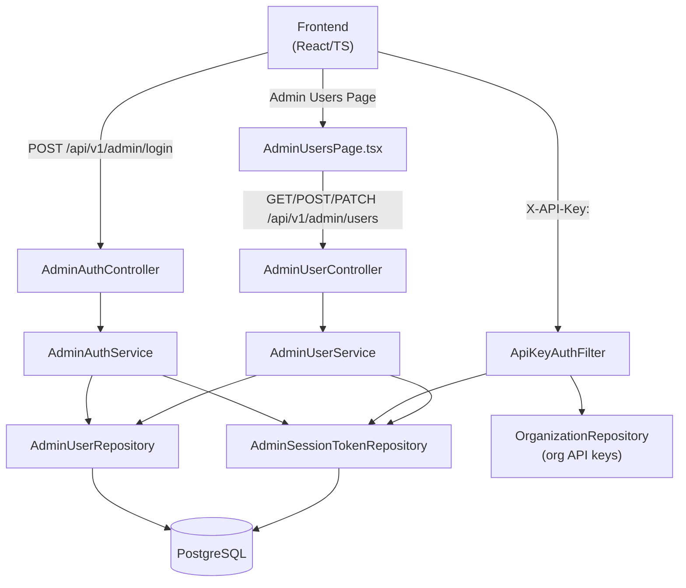

# Design Document: Admin User Management

## Overview

This feature replaces the single env-var admin account (`ADMIN_USERNAME` / `ADMIN_PASSWORD` / `ADMIN_API_KEY`) with a proper multi-user admin system backed by the database. The existing `ADMIN_API_KEY` env-var approach is removed entirely (clean break). Admin users authenticate via username/password and receive a stateful session token stored in the database, sent as the `X-API-Key` header on subsequent requests.

Key decisions:
- Token type: stateful DB tokens (stored in `admin_session_tokens` table, revocable instantly)
- Token expiry: 8 hours default, configurable via `application.yml`
- Password minimum: 8 characters
- `ADMIN_API_KEY` backward compat: removed entirely

---

## Architecture



The `ApiKeyAuthFilter` is extended to check the `admin_session_tokens` table before falling back to org API keys. The env-var admin key path is removed.

At startup, a `AdminBootstrapService` checks if the `admin_users` table is empty and seeds a bootstrap admin from `ADMIN_USERNAME` / `ADMIN_PASSWORD` env vars.

---

## Components and Interfaces

### Backend

#### New: `AdminUser` entity (`security/model/AdminUser.java`)
JPA entity mapped to `admin_users` table.

#### New: `AdminSessionToken` entity (`security/model/AdminSessionToken.java`)
JPA entity mapped to `admin_session_tokens` table. Holds the opaque token string, owning user FK, and expiry timestamp.

#### New: `AdminUserRepository` (`security/repository/AdminUserRepository.java`)
Spring Data JPA repository. Key methods:
- `findByUsername(String username): Optional<AdminUser>`
- `countByActiveTrue(): long`

#### New: `AdminSessionTokenRepository` (`security/repository/AdminSessionTokenRepository.java`)
- `findByTokenAndExpiresAtAfter(String token, Instant now): Optional<AdminSessionToken>`
- `deleteByAdminUser(AdminUser user)`

#### Modified: `AdminAuthController` (`security/AdminAuthController.java`)
- `POST /api/v1/admin/login` — delegates to `AdminAuthService`, returns `{ token, name }`
- `POST /api/v1/admin/logout` — invalidates the current token (optional, nice-to-have)

#### New: `AdminAuthService` (`security/service/AdminAuthService.java`)
- `login(username, password): AdminLoginResponse` — verifies bcrypt hash, creates session token
- `logout(token)` — deletes token from DB

#### New: `AdminUserController` (`security/AdminUserController.java`)
REST endpoints under `/api/v1/admin/users`:
- `GET /` — list all admin users
- `POST /` — create admin user
- `PATCH /{id}/deactivate` — deactivate user + invalidate tokens
- `PATCH /{id}/reactivate` — reactivate user

#### New: `AdminUserService` (`security/service/AdminUserService.java`)
Business logic for user management. Enforces the minimum-one-active-admin invariant.

#### New: `AdminBootstrapService` (`security/service/AdminBootstrapService.java`)
`@Component` with `@EventListener(ApplicationReadyEvent.class)`. Seeds bootstrap admin if table is empty.

#### Modified: `ApiKeyAuthFilter` (`security/ApiKeyAuthFilter.java`)
Lookup order:
1. Check `admin_session_tokens` table for a valid, non-expired token → grant `ROLE_ADMIN`
2. Check `organization.apiKey` → grant `ROLE_ORG`
3. No match → unauthenticated

The env-var admin key check is removed entirely.

#### Modified: `AdminProperties` (`security/AdminProperties.java`)
Remove `apiKey` field. Retain only `username` and `password` (used only for bootstrap).

#### Modified: `application.yml`
Remove `admin.api-key`. Add:
```yaml
admin:
  username: ${ADMIN_USERNAME:admin}
  password: ${ADMIN_PASSWORD:changeme}
  token-expiry-hours: ${ADMIN_TOKEN_EXPIRY_HOURS:8}
```

### Frontend

#### Modified: `client.ts`
- `adminLogin` response type changes from `{ apiKey, name }` to `{ token, name }`
- The interceptor already attaches `session.apiKey` as `X-API-Key` — rename the session field to `token` or keep `apiKey` as the field name storing the session token value (simpler: keep `apiKey` field, store the session token there — no interceptor change needed)

#### Modified: `AdminLoginPage.tsx`
- Map `res.data.token` → `session.apiKey` (or rename field consistently)
- Remove the 503 "not configured" error path

#### New: `AdminUsersPage.tsx` (`frontend/src/pages/admin/AdminUsersPage.tsx`)
Table of admin users with create form, deactivate/reactivate actions, and confirmation dialog.

#### Modified: `App.tsx` / router
Add route for the new admin users page.

---

## Data Models

### `admin_users` table

| Column | Type | Constraints |
|---|---|---|
| `id` | UUID | PK, default gen |
| `username` | VARCHAR(100) | UNIQUE, NOT NULL |
| `password_hash` | VARCHAR(255) | NOT NULL |
| `display_name` | VARCHAR(255) | NOT NULL |
| `role` | VARCHAR(50) | NOT NULL, default `'ADMIN'` |
| `active` | BOOLEAN | NOT NULL, default `true` |
| `created_at` | TIMESTAMP WITH TIME ZONE | NOT NULL, default now() |

### `admin_session_tokens` table

| Column | Type | Constraints |
|---|---|---|
| `id` | UUID | PK, default gen |
| `token` | VARCHAR(255) | UNIQUE, NOT NULL (opaque random UUID or SecureRandom hex) |
| `admin_user_id` | UUID | FK → `admin_users.id`, NOT NULL |
| `expires_at` | TIMESTAMP WITH TIME ZONE | NOT NULL |
| `created_at` | TIMESTAMP WITH TIME ZONE | NOT NULL, default now() |

Index on `token` for fast lookup in the filter. Index on `admin_user_id` for fast invalidation on deactivate.

### Java Entities

```java
@Entity @Table(name = "admin_users")
public class AdminUser {
    @Id @GeneratedValue UUID id;
    @Column(unique = true, nullable = false) String username;
    @Column(nullable = false) String passwordHash;
    @Column(nullable = false) String displayName;
    @Column(nullable = false) String role = "ADMIN";
    @Column(nullable = false) boolean active = true;
    @Column(nullable = false) Instant createdAt = Instant.now();
}

@Entity @Table(name = "admin_session_tokens")
public class AdminSessionToken {
    @Id @GeneratedValue UUID id;
    @Column(unique = true, nullable = false) String token;
    @ManyToOne(fetch = LAZY) @JoinColumn(name = "admin_user_id") AdminUser adminUser;
    @Column(nullable = false) Instant expiresAt;
    @Column(nullable = false) Instant createdAt = Instant.now();
}
```

### DTOs

```java
// Request
record AdminLoginRequest(String username, String password) {}
record CreateAdminUserRequest(String username, String password, String displayName) {}

// Response
record AdminLoginResponse(String token, String name) {}
record AdminUserDto(UUID id, String username, String displayName, String role,
                   boolean active, Instant createdAt) {}
```

### Frontend Session

The `Session` type's `apiKey` field stores the admin session token value. No structural change needed — the interceptor already sends it as `X-API-Key`. The `adminLogin` API call maps `res.data.token` → `session.apiKey`.

---

## Correctness Properties

*A property is a characteristic or behavior that should hold true across all valid executions of a system — essentially, a formal statement about what the system should do. Properties serve as the bridge between human-readable specifications and machine-verifiable correctness guarantees.*

### Property 1: Admin user persistence round-trip

*For any* valid `AdminUser` saved to the database, reloading it by ID should return an entity with identical username, display name, role, active status, and a non-null created-at timestamp.

**Validates: Requirements 1.1**

---

### Property 2: Passwords are stored as bcrypt hashes

*For any* admin user created with a plaintext password, the stored `passwordHash` field should not equal the plaintext password, and `BCryptPasswordEncoder.matches(plaintext, hash)` should return true.

**Validates: Requirements 1.2**

---

### Property 3: Valid login returns token and name

*For any* active `AdminUser` with a known password, a POST to `/api/v1/admin/login` with correct credentials should return HTTP 200 with a non-blank `token` and the user's `displayName`.

**Validates: Requirements 2.1**

---

### Property 4: Invalid credentials return 401

*For any* login request where the username does not match an active user or the password is incorrect, the response should be HTTP 401 with no token in the body.

**Validates: Requirements 2.2**

---

### Property 5: Login response never exposes password hash

*For any* login attempt (successful or not), the response body should not contain the stored bcrypt hash string.

**Validates: Requirements 2.4**

---

### Property 6: Valid session token grants ROLE_ADMIN

*For any* non-expired `AdminSessionToken` in the database, presenting it as `X-API-Key` on a request to an admin-protected endpoint should result in the request being authenticated with `ROLE_ADMIN`.

**Validates: Requirements 2.5**

---

### Property 7: Expired or invalid token is rejected

*For any* token string that is either not present in the database or has an `expiresAt` in the past, presenting it as `X-API-Key` should result in HTTP 401 (unauthenticated).

**Validates: Requirements 2.6, 3.2**

---

### Property 8: Issued tokens have correct expiry

*For any* newly issued `AdminSessionToken`, its `expiresAt` should be approximately `now + configuredExpiryHours` (within a 1-second tolerance).

**Validates: Requirements 3.1**

---

### Property 9: Deactivation invalidates all tokens

*For any* admin user with one or more active session tokens, deactivating that user should result in all of their tokens being deleted from the database, so subsequent requests using those tokens return HTTP 401.

**Validates: Requirements 3.3, 3.4, 6.1**

---

### Property 10: Created admin user is active and persisted

*For any* valid create-user request (unique username, password ≥ 8 chars, non-blank display name) submitted by an authenticated admin, the resulting `AdminUser` should be persisted with `active = true` and all supplied fields stored correctly.

**Validates: Requirements 4.1**

---

### Property 11: Short passwords are rejected

*For any* password string with length < 8, a create-user request should return HTTP 400 and no user should be created.

**Validates: Requirements 4.3**

---

### Property 12: Admin-only endpoints reject non-admin callers

*For any* request to `/api/v1/admin/users` (GET, POST, PATCH) made without a valid `ROLE_ADMIN` credential, the system should return HTTP 403.

**Validates: Requirements 4.4, 5.3, 6.4, 7.3**

---

### Property 13: User list contains all users and no sensitive fields

*For any* set of admin users in the database, the GET `/api/v1/admin/users` response should contain an entry for every user with the required fields (id, username, displayName, role, active, createdAt), and no entry should contain a `passwordHash` or session token value.

**Validates: Requirements 5.1, 5.2**

---

### Property 14: Deactivate/reactivate round-trip

*For any* admin user (when at least one other active admin exists), deactivating then reactivating that user should result in `active = true` with all other fields unchanged.

**Validates: Requirements 6.1, 7.1**

---

### Property 15: Minimum active administrator invariant

*For any* sequence of deactivation operations, the system should never allow the count of active admin users to reach zero — any deactivation that would do so must be rejected with HTTP 409.

**Validates: Requirements 8.1, 8.2, 8.3**

---

## Error Handling

| Scenario | HTTP Status | Response |
|---|---|---|
| Invalid login credentials | 401 | `{ "error": "Invalid username or password" }` |
| Login for deactivated user | 403 | `{ "error": "Account is deactivated" }` |
| Duplicate username on create | 409 | `{ "error": "Username already exists" }` |
| Password too short | 400 | `{ "error": "Password must be at least 8 characters" }` |
| Deactivate last active admin | 409 | `{ "error": "Cannot deactivate the last active administrator" }` |
| User not found | 404 | `{ "error": "Admin user not found" }` |
| No/invalid token on admin route | 401 | (Spring Security default) |
| Non-admin token on admin route | 403 | (Spring Security default) |
| Missing bootstrap env vars | — | Application refuses to start, logs error |

All error responses use a consistent `{ "error": "<message>" }` JSON body.

The `ApiKeyAuthFilter` is a `OncePerRequestFilter` — token lookup failures are silent (no exception thrown); the request simply proceeds unauthenticated and Spring Security handles the 401/403.

---

## Testing Strategy

### Unit / Integration Tests (JUnit 5 + Spring Boot Test)

Focus on specific examples and edge cases:

- Bootstrap seeding: empty table → bootstrap admin created with correct username
- Bootstrap failure: missing env vars → application context fails to load
- Login for deactivated user → 403
- Duplicate username → 409
- User not found on deactivate/reactivate → 404
- Last-admin guard: single active admin → deactivate returns 409
- Token cleanup: deactivate user → tokens deleted from DB

### Property-Based Tests (jqwik)

The project already uses jqwik. Each property test runs a minimum of 100 tries.

Tag format: `Feature: admin-user-management, Property {N}: {property_text}`

| Property | Test class | jqwik annotation |
|---|---|---|
| P1: Persistence round-trip | `AdminUserPersistencePropertyTest` | `@Property` |
| P2: Passwords stored as bcrypt | `AdminUserPersistencePropertyTest` | `@Property` |
| P3: Valid login returns token | `AdminAuthPropertyTest` | `@Property` |
| P4: Invalid credentials → 401 | `AdminAuthPropertyTest` | `@Property` |
| P5: No hash in login response | `AdminAuthPropertyTest` | `@Property` |
| P6: Valid token grants ROLE_ADMIN | `AdminSessionTokenPropertyTest` | `@Property` |
| P7: Expired/invalid token → 401 | `AdminSessionTokenPropertyTest` | `@Property` |
| P8: Token expiry is correct | `AdminSessionTokenPropertyTest` | `@Property` |
| P9: Deactivation invalidates tokens | `AdminUserServicePropertyTest` | `@Property` |
| P10: Created user is active | `AdminUserServicePropertyTest` | `@Property` |
| P11: Short passwords rejected | `AdminUserServicePropertyTest` | `@Property` |
| P12: Non-admin → 403 | `AdminUserControllerPropertyTest` | `@Property` |
| P13: List contains all, no secrets | `AdminUserControllerPropertyTest` | `@Property` |
| P14: Deactivate/reactivate round-trip | `AdminUserServicePropertyTest` | `@Property` |
| P15: Min-admin invariant | `AdminUserServicePropertyTest` | `@Property` |

Each property test references its design property in a comment:
```java
// Feature: admin-user-management, Property 15: Minimum active administrator invariant
@Property(tries = 100)
void minimumActiveAdminInvariant(...) { ... }
```
