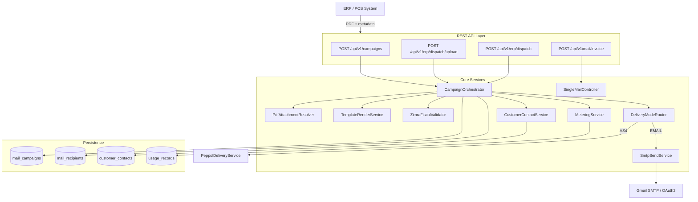
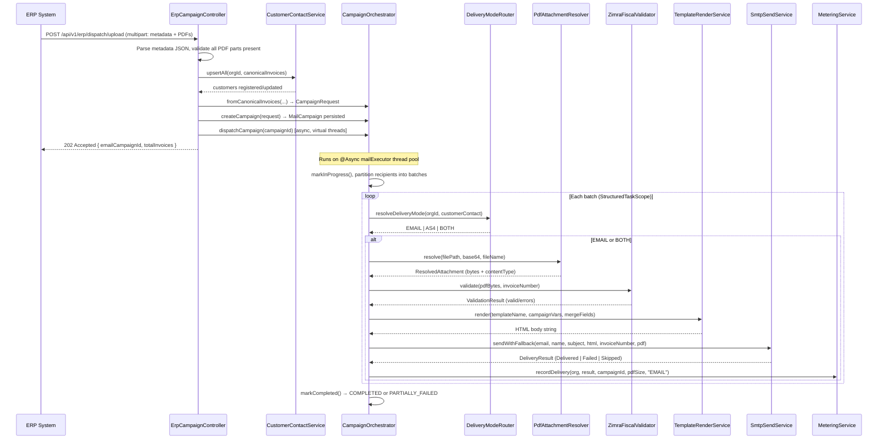
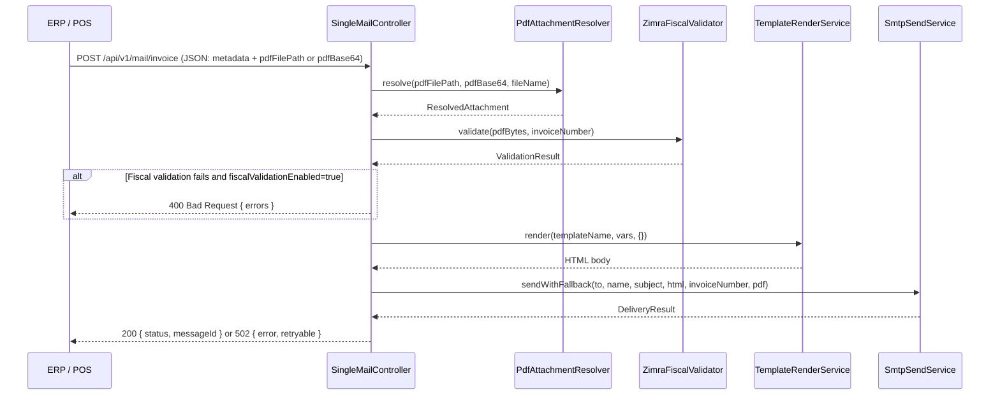

# Design Document: Fiscalised Invoice Email

## Overview

This feature delivers fiscalised PDF invoices to customers via email, forming the primary
delivery channel of the InvoiceDirect platform. The system already has a working email
dispatch pipeline (`CampaignOrchestrator`, `SmtpSendService`, `TemplateRenderService`) and
a ZIMRA fiscal validator (`ZimraFiscalValidator`). This design documents the complete
end-to-end flow — from ERP submission through fiscal validation, PDF attachment resolution,
Thymeleaf template rendering, SMTP dispatch, and delivery tracking — so that the feature
can be formally specified, tested, and extended.

The feature covers three entry points: (1) mass campaign dispatch via `POST /api/v1/campaigns`
or `POST /api/v1/erp/dispatch/upload`, (2) single real-time dispatch via
`POST /api/v1/mail/invoice`, and (3) ERP-pull dispatch via `POST /api/v1/erp/dispatch`.
All three paths converge on the same `SmtpSendService` and produce `UsageRecord` metering
entries. The design also covers the fiscal validation gate, the customer registry upsert,
and the delivery-mode routing decision (EMAIL vs PEPPOL vs BOTH).

## Architecture




## Sequence Diagrams

### Mass Campaign Dispatch (PDF Upload)



### Single Invoice Real-Time Dispatch




## Components and Interfaces

### Component 1: ErpCampaignController

**Purpose**: Entry point for multi-invoice dispatch. Accepts PDF uploads or ERP-pull requests,
upserts customers, routes to PEPPOL or email, and returns a campaign ID for polling.

**Interface**:
```java
// POST /api/v1/erp/dispatch/upload
ResponseEntity<?> uploadAndDispatch(String metadataJson, Map<String, MultipartFile> allParts)

// POST /api/v1/erp/dispatch
ResponseEntity<?> fetchAndDispatch(ErpDispatchRequest request)
```

**Responsibilities**:
- Validate all PDF multipart parts are present before any DB writes
- Upsert customer contacts via `CustomerContactService.upsertAll()`
- Delegate routing decision to `routeAndDispatch()` (EMAIL vs PEPPOL vs BOTH)
- Return `202 Accepted` with `emailCampaignId` and dispatch summary

---

### Component 2: CampaignOrchestrator

**Purpose**: Orchestrates asynchronous batch dispatch of invoice emails using Java 25
`StructuredTaskScope` for structured concurrency on virtual threads.

**Interface**:
```java
MailCampaign createCampaign(CampaignRequest request)
void dispatchCampaign(UUID campaignId)           // @Async
void retryFailed(UUID campaignId)                // @Async
CampaignResponse getCampaignStatus(UUID campaignId)
List<CampaignResponse> listCampaigns()
CampaignRequest fromCanonicalInvoices(String campaignName, String subject,
    String templateName, Map<String,Object> templateVars,
    UUID organizationId, List<CanonicalInvoice> invoices)
```

**Responsibilities**:
- Persist `MailCampaign` and `MailRecipient` records
- Partition recipients into batches (`massmailer.batch-size`, default 5000)
- Fork one virtual thread per recipient within each batch via `StructuredTaskScope`
- Resolve PDF, validate fiscal markers, render template, send SMTP per recipient
- Record `UsageRecord` via `MeteringService` for every delivery attempt
- Update campaign status: `IN_PROGRESS` → `COMPLETED` or `PARTIALLY_FAILED`

---

### Component 3: PdfAttachmentResolver

**Purpose**: Resolves a PDF from one of three sources — filesystem path, Base64 string,
or raw bytes — and validates the PDF magic bytes (`%PDF-`).

**Interface**:
```java
ResolvedAttachment resolve(String filePath, String base64, String fileName)
ResolvedAttachment resolveFromBytes(byte[] bytes, String fileName)

record ResolvedAttachment(
    String fileName,
    InputStreamSource source,
    String contentType,
    long sizeBytes
) {}
```

**Responsibilities**:
- Read file from disk (filePath) or decode Base64 string
- Validate `%PDF-` magic bytes — throw `PdfResolutionException` if invalid
- Return `ResolvedAttachment` with `InputStreamSource` for `MimeMessageHelper`

---

### Component 4: ZimraFiscalValidator

**Purpose**: Validates that a PDF has been fiscalised by a ZIMRA-registered fiscal device
by scanning the PDF content stream for FDMS markers.

**Interface**:
```java
ValidationResult validate(byte[] pdfBytes, String invoiceNumber)

record ValidationResult(boolean valid, List<String> errors) {}
```

**Responsibilities**:
- Detect `fdms.zimra.co.zw` domain in PDF content (Rule 1 — mandatory)
- Detect verification code label or 16-char hex pattern (Rule 2)
- Detect at least one fiscal device field label (Rule 3)
- Return `ValidationResult.ok()` or `ValidationResult.fail(errors)`
- Controlled by `massmailer.fiscal-validation-enabled` property

---

### Component 5: TemplateRenderService

**Purpose**: Renders Thymeleaf HTML email templates with merged campaign-level and
per-recipient invoice variables.

**Interface**:
```java
String render(String templateName, Map<String,Object> campaignVars,
              Map<String,Object> recipientMergeFields)
```

**Responsibilities**:
- Load template from `classpath:templates/email/{templateName}.html`
- Merge campaign variables with per-recipient overrides (recipient fields win)
- Return rendered HTML string for SMTP body

---

### Component 6: SmtpSendService

**Purpose**: Composes and sends a MIME multipart email (HTML body + PDF attachment)
via `JavaMailSender` with rate limiting and retry.

**Interface**:
```java
DeliveryResult send(String toEmail, String toName, String subject,
    String htmlBody, String invoiceNumber, ResolvedAttachment attachment)
    throws MessagingException

DeliveryResult sendWithFallback(String toEmail, String toName, String subject,
    String htmlBody, String invoiceNumber, ResolvedAttachment attachment)
```

**Responsibilities**:
- Compose `MimeMessage` with `MimeMessageHelper` (multipart when PDF present)
- Set no-reply headers: `X-Auto-Response-Suppress`, `Auto-Submitted`, `Precedence: bulk`
- Set `X-Invoice-Number` header for fiscal traceability
- Acquire `Semaphore` rate limiter before sending (configurable via `massmailer.rate-limit`)
- Retry up to 3× on `MessagingException` with exponential backoff (2s, 4s, 8s)
- Return sealed `DeliveryResult`: `Delivered | Failed | Skipped`

---

### Component 7: CustomerContactService

**Purpose**: Upserts customer contact records from canonical invoice data before dispatch.

**Interface**:
```java
void upsertAll(UUID organizationId, List<CanonicalInvoice> invoices)
CustomerContact upsert(UUID organizationId, CanonicalInvoice invoice)
```

**Responsibilities**:
- Find or create `CustomerContact` by `(organizationId, email)` unique key
- Update `name`, `companyName`, `erpCustomerId` from invoice data
- Respect `unsubscribed` flag — throw `IllegalArgumentException` if any recipient is unsubscribed
- Accumulate delivery statistics via `contact.recordDelivery(success)`

---

### Component 8: MeteringService

**Purpose**: Records a `UsageRecord` for every invoice delivery attempt for billing.

**Interface**:
```java
void recordDelivery(Organization org, DeliveryResult result,
    UUID campaignId, long pdfSizeBytes, String channel)
```

**Responsibilities**:
- Create `UsageRecord` with `outcome = DELIVERED | FAILED | SKIPPED`
- Derive `billingPeriod` from current UTC timestamp (YYYY-MM)
- Mark `billed = false` (billing aggregation runs separately)
- Only `DELIVERED` and `FAILED` outcomes are billable


## Data Models

### MailCampaign

```java
@Entity @Table(name = "mail_campaigns")
class MailCampaign {
    UUID id;                        // PK, auto-generated
    String name;                    // Human-readable campaign name
    String subject;                 // Email subject line
    String templateName;            // Thymeleaf template (e.g. "invoice")
    String templateVariablesJson;   // Shared campaign-level merge vars (JSON)
    UUID organizationId;            // Owning org — used for metering
    CampaignStatus status;          // CREATED → QUEUED → IN_PROGRESS → COMPLETED | PARTIALLY_FAILED
    int totalRecipients;
    int sentCount;
    int failedCount;
    int skippedCount;
    Instant createdAt;
    Instant startedAt;
    Instant completedAt;
    List<MailRecipient> recipients; // @OneToMany, lazy
}

enum CampaignStatus {
    CREATED, QUEUED, IN_PROGRESS, COMPLETED, PARTIALLY_FAILED, FAILED, CANCELLED
}
```

### MailRecipient

```java
@Entity @Table(name = "mail_recipients")
class MailRecipient {
    UUID id;
    MailCampaign campaign;          // @ManyToOne FK
    String email;                   // Normalised to lowercase
    String name;

    // Invoice identity
    String invoiceNumber;           // NOT NULL — fiscal invoice number
    LocalDate invoiceDate;
    LocalDate dueDate;

    // Financial
    BigDecimal totalAmount;
    BigDecimal vatAmount;
    String currency;                // ISO 4217: USD, ZWG, ZAR, GBP, EUR, CNY, BWP

    // ZIMRA fiscal fields
    String fiscalDeviceSerialNumber;
    String fiscalDayNumber;
    String globalInvoiceCounter;
    String verificationCode;
    String qrCodeUrl;               // max 1024 chars

    // PDF attachment (one of these must be set)
    String pdfFilePath;             // Absolute path on shared volume
    String pdfBase64;               // Base64-encoded bytes (TEXT column)
    String pdfFileName;             // Attachment filename

    String mergeFieldsJson;         // Per-recipient template overrides (JSON)

    // Delivery tracking
    RecipientStatus deliveryStatus; // PENDING → SENT | FAILED | SKIPPED
    String messageId;               // SMTP Message-ID on success
    String errorMessage;            // Error detail on failure
    int retryCount;
    Instant sentAt;
    Long attachmentSizeBytes;
}

enum RecipientStatus { PENDING, SENT, FAILED, SKIPPED, BOUNCED, UNSUBSCRIBED }
```

### CustomerContact (existing — relevant fields)

```java
@Entity @Table(name = "customer_contacts",
    uniqueConstraints = @UniqueConstraint(columnNames = {"organizationId", "email"}))
class CustomerContact {
    UUID id;
    UUID organizationId;
    String email;
    String name;
    String companyName;
    String erpCustomerId;
    DeliveryMode deliveryMode;      // null = inherit org default
    String peppolParticipantId;
    boolean unsubscribed;
    long totalInvoicesSent;
    long totalDeliveryFailures;
    Instant lastInvoiceSentAt;
}
```

### UsageRecord (existing — relevant fields)

```java
@Entity @Table(name = "usage_records")
class UsageRecord {
    UUID id;
    UUID organizationId;
    String billingPeriod;           // "YYYY-MM"
    String invoiceNumber;
    UUID campaignId;
    String recipientEmail;
    DeliveryOutcome outcome;        // DELIVERED | FAILED | SKIPPED
    String erpSource;
    Long pdfSizeBytes;
    boolean billed;
    Instant recordedAt;
}
```

### CanonicalInvoice (ACL boundary record)

```java
record CanonicalInvoice(
    ErpSource erpSource,
    String erpTenantId,
    String erpInvoiceId,
    String recipientEmail,
    String recipientName,
    String recipientCompany,
    String invoiceNumber,
    LocalDate invoiceDate,
    LocalDate dueDate,
    BigDecimal subtotalAmount,
    BigDecimal vatAmount,
    BigDecimal totalAmount,
    String currency,
    FiscalMetadata fiscalMetadata,  // verificationCode, qrCodeUrl, deviceSerial, etc.
    PdfSource pdfSource,            // filePath | base64 | downloadUrl
    Map<String,Object> additionalMergeFields
)
```


## Algorithmic Pseudocode

### Main Campaign Dispatch Algorithm

```pascal
ALGORITHM dispatchCampaign(campaignId)
INPUT: campaignId of type UUID
OUTPUT: void (side effects: DB updates, emails sent, usage records created)

PRECONDITIONS:
  - campaign exists in DB with status = QUEUED
  - all recipients have status = PENDING
  - SMTP connection is available

POSTCONDITIONS:
  - campaign.status = COMPLETED or PARTIALLY_FAILED
  - every recipient.status ∈ {SENT, FAILED, SKIPPED}
  - one UsageRecord exists per recipient
  - campaign.sentCount + campaign.failedCount + campaign.skippedCount = campaign.totalRecipients

BEGIN
  campaign ← campaignRepo.findById(campaignId)
  campaign.markInProgress()
  campaignRepo.save(campaign)

  pending ← recipientRepo.findByCampaignIdAndStatus(campaignId, PENDING)
  campaignVars ← fromJson(campaign.templateVariablesJson)
  batches ← partition(pending, batchSize)

  FOR each batch IN batches DO
    // LOOP INVARIANT: all previously processed recipients have status ∈ {SENT, FAILED, SKIPPED}
    // and campaign counters reflect processed count

    USING StructuredTaskScope DO
      tasks ← FOR each recipient IN batch FORK sendInvoiceEmail(campaign, recipient, campaignVars)
      JOIN all tasks

      FOR each (recipient, result) IN zip(batch, tasks) DO
        MATCH result WITH
          | Delivered(messageId, size) →
              recipient.markSent(messageId, size)
              campaign.incrementSent()
          | Failed(error, retryable) →
              recipient.markFailed(error)
              campaign.incrementFailed()
          | Skipped(reason) →
              recipient.markSkipped(reason)
              campaign.incrementSkipped()
        END MATCH

        orgRepo.findById(campaign.organizationId).ifPresent(org →
          meteringService.recordDelivery(org, result, campaign.id, pdfSize, "EMAIL")
        )
      END FOR

      recipientRepo.saveAll(batch)
    END USING

    campaignRepo.save(campaign)
    sleep(1000ms)  // inter-batch SMTP breathing room
  END FOR

  campaign.markCompleted()
  campaignRepo.save(campaign)
END
```

**Loop Invariant**: After each batch completes, `campaign.sentCount + campaign.failedCount + campaign.skippedCount` equals the number of recipients processed so far, and all processed recipients have a terminal status.

---

### Single Invoice Send Algorithm

```pascal
ALGORITHM sendInvoiceEmail(campaign, recipient, campaignVars)
INPUT: campaign: MailCampaign, recipient: MailRecipient, campaignVars: Map
OUTPUT: DeliveryResult (Delivered | Failed | Skipped)

PRECONDITIONS:
  - recipient.invoiceNumber is non-null and non-blank
  - campaign.templateName refers to an existing Thymeleaf template

POSTCONDITIONS:
  - IF result = Delivered THEN SMTP accepted the message AND messageId is non-null
  - IF result = Skipped THEN no PDF was available (no SMTP attempt made)
  - IF result = Failed THEN SMTP rejected after retries OR PDF resolution failed

BEGIN
  // Step 1: Guard — no PDF means skip (not an error)
  IF NOT recipient.hasPdfAttachment() THEN
    RETURN Skipped(recipient.email, recipient.invoiceNumber, "No PDF attachment")
  END IF

  // Step 2: Resolve PDF bytes
  pdf ← pdfResolver.resolve(recipient.pdfFilePath, recipient.pdfBase64, recipient.pdfFileName)
  IF pdf = null THEN
    RETURN Skipped(recipient.email, recipient.invoiceNumber, "PDF resolver returned null")
  END IF

  // Step 3: Fiscal validation gate (when enabled)
  IF fiscalValidationEnabled THEN
    result ← fiscalValidator.validate(pdf.bytes, recipient.invoiceNumber)
    IF NOT result.valid THEN
      RETURN Failed(recipient.email, recipient.invoiceNumber,
                    "Fiscal validation failed: " + result.errors, false)
    END IF
  END IF

  // Step 4: Build per-recipient merge fields
  mergeFields ← buildInvoiceMergeFields(recipient)
  // mergeFields includes: recipientName, invoiceNumber, invoiceDate, dueDate,
  //   totalAmount, vatAmount, currency, currencySymbol,
  //   fiscalDeviceSerialNumber, fiscalDayNumber, globalInvoiceCounter,
  //   verificationCode, qrCodeUrl, plus any extra from mergeFieldsJson

  // Step 5: Render HTML body
  html ← templateService.render(campaign.templateName, campaignVars, mergeFields)

  // Step 6: Send via SMTP with retry
  RETURN smtpService.sendWithFallback(
    recipient.email, recipient.name,
    campaign.subject, html,
    recipient.invoiceNumber, pdf
  )
END
```

---

### PDF Resolution Algorithm

```pascal
ALGORITHM resolve(filePath, base64, fileName)
INPUT: filePath: String | null, base64: String | null, fileName: String
OUTPUT: ResolvedAttachment

PRECONDITIONS:
  - At least one of filePath or base64 is non-null and non-blank

POSTCONDITIONS:
  - result.bytes starts with "%PDF-" magic bytes
  - result.fileName = fileName (defaulted to "invoice.pdf" if blank)
  - result.contentType = "application/pdf"

BEGIN
  IF filePath is non-blank THEN
    bytes ← Files.readAllBytes(Path.of(filePath))
  ELSE IF base64 is non-blank THEN
    bytes ← Base64.decode(base64)
  ELSE
    THROW PdfResolutionException("No PDF source provided")
  END IF

  IF NOT bytes starts with [0x25, 0x50, 0x44, 0x46, 0x2D] THEN  // "%PDF-"
    THROW PdfResolutionException("File does not have valid PDF magic bytes")
  END IF

  RETURN ResolvedAttachment(
    fileName = fileName ?: "invoice.pdf",
    source = ByteArrayResource(bytes),
    contentType = "application/pdf",
    sizeBytes = bytes.length
  )
END
```

---

### ZIMRA Fiscal Validation Algorithm

```pascal
ALGORITHM validateFiscalMarkers(pdfBytes, invoiceNumber)
INPUT: pdfBytes: byte[], invoiceNumber: String
OUTPUT: ValidationResult

PRECONDITIONS:
  - pdfBytes is non-null and non-empty
  - pdfBytes represents a valid PDF document

POSTCONDITIONS:
  - IF result.valid = true THEN pdfBytes contains all three ZIMRA marker categories
  - IF result.valid = false THEN result.errors contains at least one descriptive message

BEGIN
  content ← decode(pdfBytes, ISO_8859_1)
  errors ← []

  // Rule 1: FDMS domain (mandatory — strongest indicator)
  IF NOT content contains "fdms.zimra.co.zw" THEN
    errors.add("Missing ZIMRA FDMS verification URL")
  END IF

  // Rule 2: Verification code (label OR 16-char hex pattern)
  hasCodeLabel ← content contains "Verification Code" OR "Verification URL"
  hasCodePattern ← content matches /[0-9A-F]{16}/
  IF NOT (hasCodeLabel OR hasCodePattern) THEN
    errors.add("Missing ZIMRA verification code")
  END IF

  // Rule 3: At least one fiscal device field
  hasFiscalField ← content contains any of:
    "Device ID", "Fiscal Day", "Fiscal Invoice", "Global Receipt"
  IF NOT hasFiscalField THEN
    errors.add("Missing fiscal device fields")
  END IF

  IF errors is empty THEN
    RETURN ValidationResult.ok()
  ELSE
    RETURN ValidationResult.fail(errors)
  END IF
END
```

---

### Delivery Mode Routing Algorithm

```pascal
ALGORITHM resolveDeliveryMode(organizationId, recipientEmail)
INPUT: organizationId: UUID, recipientEmail: String
OUTPUT: DeliveryMode (EMAIL | AS4 | BOTH)

PRECONDITIONS:
  - organizationId is non-null

POSTCONDITIONS:
  - result reflects customer-level override if set, otherwise org default
  - result defaults to EMAIL if neither is configured

BEGIN
  orgMode ← orgRepo.findById(organizationId)
              .map(org → org.deliveryMode ?: EMAIL)
              .orElse(EMAIL)

  contact ← customerRepo.findByOrganizationIdAndEmail(organizationId, recipientEmail)
  IF contact is present AND contact.deliveryMode is non-null THEN
    RETURN contact.deliveryMode  // customer override wins
  END IF

  RETURN orgMode
END
```


## Key Functions with Formal Specifications

### CampaignOrchestrator.createCampaign()

```java
MailCampaign createCampaign(CampaignRequest request)
```

**Preconditions:**
- `request.name()` is non-blank
- `request.subject()` is non-blank
- `request.templateName()` is non-blank
- `request.recipients()` is non-empty
- Each `InvoiceRecipientEntry.invoiceNumber()` is non-blank
- Each `InvoiceRecipientEntry.email()` is a valid RFC 5321 address

**Postconditions:**
- A `MailCampaign` row is persisted with `status = QUEUED`
- `campaign.totalRecipients == request.recipients().size()`
- One `MailRecipient` row is persisted per entry, all with `status = PENDING`
- `campaign.id` is non-null and globally unique

**Loop Invariants:** N/A (no loops — single batch insert)

---

### CampaignOrchestrator.dispatchCampaign()

```java
@Async void dispatchCampaign(UUID campaignId)
```

**Preconditions:**
- Campaign exists with `status = QUEUED`
- All recipients have `status = PENDING`

**Postconditions:**
- `campaign.status ∈ {COMPLETED, PARTIALLY_FAILED}`
- `∀ r ∈ recipients: r.status ∈ {SENT, FAILED, SKIPPED}`
- `campaign.sentCount + campaign.failedCount + campaign.skippedCount == campaign.totalRecipients`
- `∀ r with status=SENT: r.messageId ≠ null ∧ r.sentAt ≠ null`
- One `UsageRecord` exists per recipient

**Loop Invariants:**
- After each batch: processed count = sentCount + failedCount + skippedCount
- All processed recipients have terminal status

---

### SmtpSendService.send()

```java
DeliveryResult send(String toEmail, String toName, String subject,
    String htmlBody, String invoiceNumber, ResolvedAttachment attachment)
    throws MessagingException
```

**Preconditions:**
- `toEmail` is a valid RFC 5321 email address
- `subject` is non-blank
- `htmlBody` is non-blank
- `invoiceNumber` is non-blank (used for `X-Invoice-Number` header)
- SMTP connection is available

**Postconditions:**
- IF returns `Delivered`: SMTP server accepted the message; `messageId` is non-null
- IF throws `MessagingException`: Spring Retry will attempt up to 3 times with backoff
- After 3 failures: `sendWithFallback()` returns `Failed(retryable=true)` for transient errors
- `X-Invoice-Number` header is set on every outbound message
- Rate limiter semaphore is always released (finally block)

**Loop Invariants:** N/A

---

### ZimraFiscalValidator.validate()

```java
ValidationResult validate(byte[] pdfBytes, String invoiceNumber)
```

**Preconditions:**
- `pdfBytes` is non-null and non-empty
- `pdfBytes` starts with `%PDF-` (validated by `PdfAttachmentResolver` before this call)

**Postconditions:**
- `result.valid == true` iff all three rules pass
- `result.errors.isEmpty() == result.valid`
- No mutations to `pdfBytes`
- No I/O side effects

**Loop Invariants:** N/A (linear scan — no loops with invariants)

---

### PdfAttachmentResolver.resolve()

```java
ResolvedAttachment resolve(String filePath, String base64, String fileName)
```

**Preconditions:**
- At least one of `filePath` or `base64` is non-null and non-blank

**Postconditions:**
- IF `filePath` is provided: file exists on disk and is readable
- `result.source` wraps the raw PDF bytes
- `result.bytes[0..4] == "%PDF-"` (magic bytes validated)
- `result.contentType == "application/pdf"`
- `result.sizeBytes > 0`
- Throws `PdfResolutionException` if file not found, unreadable, or invalid magic bytes

**Loop Invariants:** N/A

---

### CustomerContactService.upsertAll()

```java
void upsertAll(UUID organizationId, List<CanonicalInvoice> invoices)
```

**Preconditions:**
- `organizationId` is non-null
- `invoices` is non-empty
- Each `invoice.recipientEmail()` is non-null and non-blank

**Postconditions:**
- `∀ inv ∈ invoices: ∃ CustomerContact c where c.organizationId == organizationId ∧ c.email == inv.recipientEmail().toLowerCase()`
- Existing contacts are updated (name, companyName, erpCustomerId) if new values are non-blank
- Throws `IllegalArgumentException` if any recipient has `unsubscribed == true`
- No duplicate contacts created (upsert by unique key `(organizationId, email)`)

**Loop Invariants:**
- After processing k invoices: k contacts exist or have been updated in the registry


## Example Usage

### Example 1: Mass Campaign via PDF Upload (curl)

```bash
curl -X POST https://ap.invoicedirect.biz/api/v1/erp/dispatch/upload \
  -H "X-API-Key: 9ca22fce40834c6c897bcf32c89b369c" \
  -F 'metadata={
    "campaignName": "March 2026 Invoices",
    "subject": "Your Invoice from Acme Holdings",
    "templateName": "invoice",
    "organizationId": "d4f7a2c1-8b3e-4f5a-9c2d-1a2b3c4d5e6f",
    "templateVariables": {
      "companyName": "Acme Holdings (Pvt) Ltd",
      "accountsEmail": "accounts@acmeholdings.co.zw",
      "companyAddress": "45 Borrowdale Road, Harare"
    },
    "invoices": [
      {
        "invoiceNumber": "INV-2026-0042",
        "recipientEmail": "finance@clientco.co.zw",
        "recipientName": "Jane Moyo",
        "recipientCompany": "Client Company Ltd",
        "invoiceDate": "2026-03-01",
        "dueDate": "2026-03-31",
        "totalAmount": 1250.00,
        "vatAmount": 187.50,
        "currency": "USD",
        "fiscalDeviceSerialNumber": "FD-SN-12345",
        "fiscalDayNumber": "42",
        "globalInvoiceCounter": "1001",
        "verificationCode": "ABCD-EFGH-1234",
        "qrCodeUrl": "https://fdms.zimra.co.zw/verify?code=ABCD-EFGH-1234"
      }
    ]
  }' \
  -F "INV-2026-0042=@/path/to/INV-2026-0042.pdf"
```

**Response (202 Accepted):**
```json
{
  "totalInvoices": 1,
  "peppolDispatched": 0,
  "emailDispatched": 1,
  "emailCampaignId": "a0879a37-d4ce-40a5-aec5-38c64b087678",
  "message": "0 via PEPPOL BIS 3.0, 1 via email PDF"
}
```

---

### Example 2: Single Real-Time Invoice (JSON)

```bash
curl -X POST https://ap.invoicedirect.biz/api/v1/mail/invoice \
  -H "X-API-Key: 9ca22fce40834c6c897bcf32c89b369c" \
  -H "Content-Type: application/json" \
  -d '{
    "to": "finance@clientco.co.zw",
    "recipientName": "Jane Moyo",
    "subject": "Invoice INV-2026-0042 from Acme Holdings",
    "templateName": "invoice",
    "invoiceNumber": "INV-2026-0042",
    "invoiceDate": "2026-03-01",
    "dueDate": "2026-03-31",
    "totalAmount": 1250.00,
    "vatAmount": 187.50,
    "currency": "USD",
    "fiscalDeviceSerialNumber": "FD-SN-12345",
    "verificationCode": "ABCD-EFGH-1234",
    "qrCodeUrl": "https://fdms.zimra.co.zw/verify?code=ABCD-EFGH-1234",
    "pdfFilePath": "/var/lib/odoo/invoices/INV-2026-0042.pdf",
    "variables": {
      "companyName": "Acme Holdings (Pvt) Ltd",
      "accountsEmail": "accounts@acmeholdings.co.zw"
    }
  }'
```

**Response (200 OK):**
```json
{
  "status": "delivered",
  "recipient": "finance@clientco.co.zw",
  "invoiceNumber": "INV-2026-0042",
  "messageId": "<abc123@smtp.gmail.com>",
  "error": null,
  "retryable": false
}
```

---

### Example 3: Poll Campaign Status

```bash
curl https://ap.invoicedirect.biz/api/v1/campaigns/a0879a37-d4ce-40a5-aec5-38c64b087678 \
  -H "X-API-Key: 9ca22fce40834c6c897bcf32c89b369c"
```

**Response:**
```json
{
  "id": "a0879a37-d4ce-40a5-aec5-38c64b087678",
  "name": "March 2026 Invoices",
  "status": "COMPLETED",
  "totalRecipients": 45,
  "sent": 44,
  "failed": 1,
  "skipped": 0,
  "createdAt": "2026-03-26T08:00:00Z",
  "completedAt": "2026-03-26T08:02:30Z"
}
```

---

### Example 4: Retry Failed Recipients

```bash
curl -X POST https://ap.invoicedirect.biz/api/v1/campaigns/a0879a37-d4ce-40a5-aec5-38c64b087678/retry \
  -H "X-API-Key: 9ca22fce40834c6c897bcf32c89b369c"
```

**Response: 202 Accepted** (no body — poll status to track retry progress)


## Correctness Properties

*A property is a characteristic or behavior that should hold true across all valid executions of a system — essentially, a formal statement about what the system should do. Properties serve as the bridge between human-readable specifications and machine-verifiable correctness guarantees.*

The following properties must hold for all valid inputs. These are expressed as
universally quantified invariants suitable for property-based testing with jqwik.

### P1 — Campaign Completeness
For every dispatched campaign C:
```
sentCount(C) + failedCount(C) + skippedCount(C) == totalRecipients(C)
```
No recipient is lost or double-counted.

**Validates: Requirements 3.4**

### P2 — Recipient Terminal Status
For every completed campaign C and every recipient R in C:
```
status(C) ∈ {COMPLETED, PARTIALLY_FAILED}
  ⟹ status(R) ∈ {SENT, FAILED, SKIPPED}
```
No recipient remains in PENDING state after campaign completion.

**Validates: Requirements 3.3**

### P3 — Delivery Correlation
For every recipient R with `status = SENT`:
```
messageId(R) ≠ null ∧ sentAt(R) ≠ null ∧ attachmentSizeBytes(R) ≥ 0
```

**Validates: Requirements 8.8**

### P4 — Metering Coverage
For every dispatched campaign C and every recipient R in C:
```
∃ UsageRecord u where u.campaignId == C.id ∧ u.recipientEmail == R.email
  ∧ u.invoiceNumber == R.invoiceNumber
```
Every delivery attempt produces exactly one usage record.

**Validates: Requirements 10.1, 10.4**

### P5 — Billable Outcomes
For every UsageRecord U:
```
U.isBillable() ⟺ U.outcome ∈ {DELIVERED, FAILED}
```
Skipped invoices are never billed.

**Validates: Requirements 10.5, 10.6**

### P6 — PDF Magic Bytes
For every `ResolvedAttachment` A returned by `PdfAttachmentResolver`:
```
A.source.bytes[0..4] == [0x25, 0x50, 0x44, 0x46, 0x2D]  // "%PDF-"
```
No non-PDF bytes are ever attached to an email.

**Validates: Requirements 5.3, 5.4**

### P7 — Fiscal Validation Gate
When `fiscalValidationEnabled = true`, for every invoice I dispatched via email:
```
ZimraFiscalValidator.validate(I.pdfBytes, I.invoiceNumber).valid == true
```
No unfiscalised PDF is delivered when validation is enabled.

**Validates: Requirements 6.1, 6.2, 6.3, 6.4**

### P8 — Customer Registry Completeness
For every campaign C with `organizationId` set, and every recipient R in C:
```
∃ CustomerContact cc where cc.organizationId == C.organizationId
  ∧ cc.email == R.email.toLowerCase()
```
Every dispatched recipient has a customer contact record. Upsert is idempotent: calling
`upsertAll()` multiple times with the same data produces exactly one record per
`(organizationId, email)` pair.

**Validates: Requirements 9.1, 9.3, 9.4**

### P9 — Unsubscribe Enforcement
For every CustomerContact CC with `unsubscribed = true`:
```
¬∃ MailRecipient R where R.email == CC.email ∧ R.status == SENT
```
Unsubscribed customers never receive invoice emails.

**Validates: Requirements 9.5**

### P10 — Delivery Mode Routing
For every recipient R routed to EMAIL channel:
```
effectiveDeliveryMode(R) ∈ {EMAIL, BOTH}
```
No invoice is emailed to a customer whose effective mode is `AS4` only. Customer-level
override always takes precedence over the organisation default.

**Validates: Requirements 11.1, 11.4, 11.6**

### P11 — Retry Idempotency
For every retry of campaign C:
```
retryCount(R) ≤ maxRetries ∧ status(R) == FAILED
  ⟹ R is eligible for retry
```
Only failed recipients within the retry limit are re-dispatched.

**Validates: Requirements 12.1, 12.2, 12.3, 12.4**

### P12 — Currency Symbol Mapping
For every `MailRecipient` R with a non-null currency:
```
ZimbabweCurrency.symbolFor(R.currency) ≠ null
```
Every supported currency has a display symbol.

**Validates: Requirements 13.2, 13.3**


## Error Handling

### Error Scenario 1: Missing PDF Parts (Upload)

**Condition**: One or more `invoiceNumber` entries in the metadata have no matching
multipart file part in the request.

**Response**: `400 Bad Request`
```json
{
  "status": 400,
  "error": "Missing PDF Parts",
  "message": "No PDF file part found for invoice(s): [INV-2026-0042]. Each invoiceNumber must have a matching multipart file part.",
  "path": "/api/v1/erp/dispatch/upload"
}
```

**Recovery**: Caller must re-submit the request with all PDF parts present. No DB writes
occur before this validation passes.

---

### Error Scenario 2: Invalid PDF (Not a PDF)

**Condition**: A file part is present but does not start with `%PDF-` magic bytes.

**Response**: `400 Bad Request` (single invoice) or recipient marked `SKIPPED` (campaign)
```json
{
  "status": "failed",
  "error": "PDF error: File does not have valid PDF magic bytes (%PDF-): /path/to/file.pdf"
}
```

**Recovery**: Caller must provide a valid PDF file.

---

### Error Scenario 3: Fiscal Validation Failure

**Condition**: `fiscalValidationEnabled = true` and the PDF does not contain ZIMRA FDMS markers.

**Response**: Recipient marked `FAILED` with error message listing missing markers.

**Recovery**: The invoice must be fiscalised by a ZIMRA-registered fiscal device before dispatch.
This is a permanent failure — retry will not succeed until the PDF is replaced.

---

### Error Scenario 4: SMTP Transient Failure

**Condition**: SMTP connection timeout, rate limit, or temporary server error.

**Response**: Spring `@Retryable` retries up to 3× with exponential backoff (2s, 4s, 8s).
After exhaustion, recipient is marked `FAILED` with `retryable = true`.

**Recovery**: Call `POST /api/v1/campaigns/{id}/retry`. The retry re-dispatches all
`FAILED` recipients with `retryCount < maxRetries`.

---

### Error Scenario 5: SMTP Permanent Failure

**Condition**: Invalid recipient address (550 error), domain not found, or permanent rejection.

**Response**: Recipient marked `FAILED` with `retryable = false`.

**Recovery**: Correct the recipient email address and create a new campaign. Retry will
not succeed for permanent failures.

---

### Error Scenario 6: Unsubscribed Customer

**Condition**: `CustomerContactService.upsertAll()` encounters a recipient with
`unsubscribed = true`.

**Response**: `400 Bad Request` — entire dispatch is rejected before any emails are sent.
```json
{
  "status": 400,
  "error": "Customer Registration Failed",
  "message": "Recipient finance@clientco.co.zw has unsubscribed from invoice emails",
  "path": "/api/v1/erp/dispatch/upload"
}
```

**Recovery**: Remove the unsubscribed recipient from the invoice list before re-submitting.

---

### Error Scenario 7: Template Not Found

**Condition**: `templateName` does not correspond to an existing Thymeleaf template file.

**Response**: Recipient marked `FAILED` with a template resolution error.

**Recovery**: Use a valid template name (e.g. `"invoice"`) or create the template at
`src/main/resources/templates/email/{templateName}.html`.

---

### Error Scenario 8: Campaign Not Found (Status Poll / Retry)

**Condition**: `GET /api/v1/campaigns/{id}` or `POST /api/v1/campaigns/{id}/retry` called
with an unknown campaign ID.

**Response**: `404 Not Found`
```json
{
  "status": 404,
  "error": "Not Found",
  "message": "Campaign not found: d4f7a2c1-0000-0000-0000-000000000000"
}
```


## Testing Strategy

### Unit Testing Approach

Each service is tested in isolation with mocked dependencies.

Key unit test classes (following existing `*PropertyTest` naming convention):

- `CampaignOrchestratorPropertyTest` — campaign creation, dispatch, retry logic
- `ZimraFiscalValidatorPropertyTest` — fiscal marker detection across PDF variants
- `PdfAttachmentResolverPropertyTest` — magic byte validation, Base64 decoding
- `SmtpSendServicePropertyTest` — MIME composition, rate limiter, retry behaviour
- `CustomerContactServicePropertyTest` — upsert logic, unsubscribe enforcement
- `DeliveryModeRoutingPropertyTest` — customer override vs org default routing

### Property-Based Testing Approach

**Property Test Library**: jqwik (already used throughout the codebase)

Key properties to test with generated inputs:

```java
// P1 — Campaign completeness
@Property
void campaignCountersAlwaysSum(@ForAll CampaignRequest request) {
    MailCampaign campaign = orchestrator.createCampaign(request);
    // after dispatch...
    assertThat(campaign.getSentCount() + campaign.getFailedCount() + campaign.getSkippedCount())
        .isEqualTo(campaign.getTotalRecipients());
}

// P6 — PDF magic bytes
@Property
void resolvedAttachmentAlwaysHasPdfMagicBytes(@ForAll @ValidPdf byte[] pdfBytes) {
    ResolvedAttachment att = resolver.resolveFromBytes(pdfBytes, "test.pdf");
    assertThat(att.source().getInputStream().readNBytes(5))
        .isEqualTo(new byte[]{0x25, 0x50, 0x44, 0x46, 0x2D});
}

// P5 — Billable outcomes
@Property
void onlyDeliveredAndFailedAreBillable(@ForAll DeliveryOutcome outcome) {
    UsageRecord record = UsageRecord.builder().outcome(outcome).build();
    assertThat(record.isBillable())
        .isEqualTo(outcome == DELIVERED || outcome == FAILED);
}

// P9 — Unsubscribe enforcement
@Property
void unsubscribedCustomersAreNeverSentTo(@ForAll @Unsubscribed CustomerContact contact) {
    assertThatThrownBy(() -> customerService.upsertAll(orgId, invoicesFor(contact)))
        .isInstanceOf(IllegalArgumentException.class);
}
```

### Integration Testing Approach

- `CampaignDispatchIntegrationTest` — full dispatch flow with embedded H2, mock SMTP
  (`GreenMail`), and real `TemplateRenderService`
- `ErpCampaignControllerIntegrationTest` — multipart upload endpoint with `MockMvc`,
  verifying customer upsert and campaign creation
- `SingleMailControllerIntegrationTest` — synchronous dispatch with mock SMTP

## Performance Considerations

- **Virtual threads**: `dispatchCampaign()` uses `StructuredTaskScope` (Java 25) — each
  recipient runs on a virtual thread, enabling high concurrency without thread pool exhaustion.
- **Batch size**: Configurable via `massmailer.batch-size` (default 5000). Larger batches
  reduce inter-batch pauses but increase memory pressure from in-flight PDF bytes.
- **Rate limiter**: `Semaphore` in `SmtpSendService` caps concurrent SMTP connections.
  Set `massmailer.rate-limit` to match the Gmail OAuth2 sending quota (default 1000/day,
  2000/day for Workspace).
- **PDF memory**: Base64-encoded PDFs are stored in `TEXT` columns. For large campaigns
  (>1000 invoices), prefer `pdfFilePath` over `pdfBase64` to avoid heap pressure.
- **Inter-batch pause**: 1000ms sleep between batches gives the SMTP relay time to process
  the previous batch and avoids rate-limit errors.

## Security Considerations

- **API key authentication**: All dispatch endpoints require `X-API-Key` header. The key
  is scoped to an organisation and validated by `ApiKeyAuthFilter`.
- **No-reply enforcement**: `SmtpSendService` sets `X-Auto-Response-Suppress: All` and
  `Auto-Submitted: auto-generated` to prevent auto-reply loops.
- **PDF validation**: Magic byte check prevents non-PDF files from being attached and
  potentially exploiting email client vulnerabilities.
- **Fiscal validation**: When enabled, `ZimraFiscalValidator` ensures only ZIMRA-signed
  invoices are dispatched, preventing fraudulent invoice delivery.
- **Unsubscribe enforcement**: `CustomerContactService` blocks dispatch to unsubscribed
  recipients before any SMTP connection is made.
- **PII in logs**: Invoice numbers and recipient emails appear in logs at `INFO` level.
  In production, configure log masking or set `com.esolutions.massmailer` to `WARN`.
- **Base64 PDF storage**: `pdfBase64` is stored in a `TEXT` column. Consider encrypting
  at rest or clearing the column after successful dispatch.

## Dependencies

| Dependency | Purpose |
|---|---|
| Spring Boot Mail (`spring-boot-starter-mail`) | `JavaMailSender`, `MimeMessageHelper` |
| Thymeleaf (`spring-boot-starter-thymeleaf`) | HTML email template rendering |
| Spring Retry (`spring-retry`) | `@Retryable` on `SmtpSendService.send()` |
| Spring Async (`@EnableAsync`) | `@Async` on `CampaignOrchestrator.dispatchCampaign()` |
| Java 25 `StructuredTaskScope` | Structured concurrency for batch dispatch |
| Gmail OAuth2 (`GmailOAuth2MailConfig`) | XOAUTH2 SMTP authentication |
| PostgreSQL / Hibernate | Persistence for campaigns, recipients, usage records |
| jqwik | Property-based testing |
| Lombok | Boilerplate reduction on entity classes |
