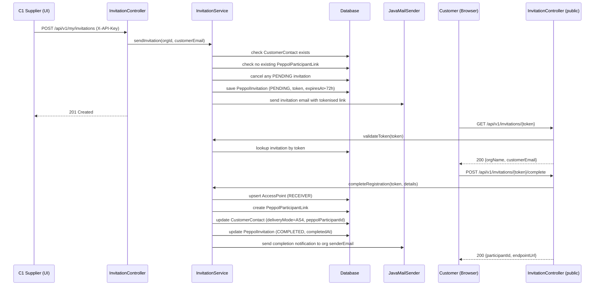

# Design Document: PEPPOL Customer Invitation

## Overview

This feature enables C1 suppliers on InvoiceDirect to invite their customers to self-register onto the PEPPOL network via a tokenised email link. The customer clicks the link, fills in their PEPPOL endpoint details on a public self-registration page, and the system automatically creates the `AccessPoint` and `PeppolParticipantLink` records in the eRegistry — enabling direct ERP-to-ERP invoice delivery without admin involvement.

The design follows the existing patterns in the codebase: Spring Boot backend with JPA entities, React/TypeScript frontend with React Router, API key authentication via `X-API-Key` header, and Thymeleaf email templates.

---

## Architecture

The feature introduces a new `invitation` package alongside the existing `peppol` and `customer` packages. The flow has two distinct paths:

**Supplier path (authenticated):** The C1 supplier triggers an invitation from the Customers page. The backend creates a `PeppolInvitation` record and sends an email via the existing Gmail OAuth2 mail infrastructure.

**Customer path (public):** The customer clicks the tokenised link, lands on a public React page, validates the token, submits their PEPPOL details, and the backend atomically creates the `AccessPoint`, `PeppolParticipantLink`, updates the `CustomerContact`, and marks the invitation `COMPLETED`.



---

## Components and Interfaces

### Backend

**`PeppolInvitation` entity** — `com.esolutions.massmailer.invitation.model`

New JPA entity persisted to `peppol_invitations` table.

**`InvitationRepository`** — `com.esolutions.massmailer.invitation.repository`

Spring Data JPA repository for `PeppolInvitation`.

**`InvitationService`** — `com.esolutions.massmailer.invitation.service`

Core business logic: create, validate, complete, cancel, list, and expire invitations. Orchestrates writes to `AccessPointRepository`, `PeppolParticipantLinkRepository`, `CustomerContactRepository`, and `InvitationRepository` within a single `@Transactional` boundary.

**`InvitationController`** — `com.esolutions.massmailer.invitation.controller`

Two groups of endpoints:

| Method | Path | Auth | Description |
|--------|------|------|-------------|
| `POST` | `/api/v1/my/invitations` | `ROLE_ORG` | Send invitation to a customer |
| `GET` | `/api/v1/my/invitations` | `ROLE_ORG` | List invitations for the org |
| `DELETE` | `/api/v1/my/invitations/{id}` | `ROLE_ORG` | Cancel a PENDING invitation |
| `GET` | `/api/v1/invitations/{token}` | Public | Validate token, return context |
| `POST` | `/api/v1/invitations/{token}/complete` | Public | Submit PEPPOL details |

**`InvitationExpiryJob`** — `com.esolutions.massmailer.invitation.job`

Scheduled job (`@Scheduled`) that transitions PENDING invitations past their `expiresAt` to `EXPIRED` status.

**Email templates** — `classpath:/templates/email/`

- `peppol-invitation.html` — invitation email with tokenised link
- `peppol-invitation-complete.html` — completion notification to the supplier

### Frontend

**`PeppolInvitePage`** — `frontend/src/pages/PeppolInvitePage.tsx`

Public page (no auth required), route: `/invite/peppol/:token`. On mount, calls `GET /api/v1/invitations/{token}`. Renders either an error state (invalid/expired/used token) or the registration form. On submit, calls `POST /api/v1/invitations/{token}/complete` and shows a success confirmation.

**`CustomersPage` update** — adds an "Invite to PEPPOL" button per customer row. Only shown for customers without an existing `peppolParticipantId`. Calls `POST /api/v1/my/invitations`.

**`client.ts` additions** — new API functions: `sendPeppolInvitation`, `listInvitations`, `cancelInvitation`, `validateInvitationToken`, `completeInvitation`.

**`types.ts` additions** — `PeppolInvitation` interface, `InvitationStatus` type.

### Security

The `SecurityConfig` is updated to permit `/api/v1/invitations/**` without authentication (public token-gated endpoints). The management endpoints under `/api/v1/my/invitations/**` are already covered by the existing `ROLE_ORG` rule for `/api/v1/my/**`.

---

## Data Models

### `PeppolInvitation` Entity

```java
@Entity
@Table(name = "peppol_invitations",
    uniqueConstraints = @UniqueConstraint(
        name = "uk_invitation_token", columnNames = {"token"}),
    indexes = {
        @Index(name = "idx_inv_org", columnList = "organizationId"),
        @Index(name = "idx_inv_token", columnList = "token"),
        @Index(name = "idx_inv_status", columnList = "status")
    })
public class PeppolInvitation {
    @Id @GeneratedValue(strategy = GenerationType.UUID)
    private UUID id;

    @Column(nullable = false)
    private UUID organizationId;

    @Column(nullable = false)
    private UUID customerContactId;

    @Column(nullable = false)
    private String customerEmail;

    /** Cryptographically random UUID v4 — single-use */
    @Column(nullable = false, unique = true, length = 36)
    private String token;

    @Enumerated(EnumType.STRING)
    @Column(nullable = false, length = 20)
    private InvitationStatus status; // PENDING, COMPLETED, CANCELLED, EXPIRED

    @Column(nullable = false)
    private Instant expiresAt;       // createdAt + 72 hours

    @Column(nullable = false)
    private Instant createdAt;

    private Instant completedAt;
}
```

### `InvitationStatus` Enum

```
PENDING    — awaiting customer action
COMPLETED  — customer has registered
CANCELLED  — cancelled by the supplier
EXPIRED    — past expiresAt without completion
```

### Token Validation Response DTO

```java
record TokenValidationResponse(
    String customerEmail,
    String organisationName
    // NOTE: no API key, no internal org ID
)
```

### Complete Registration Request DTO

```java
record CompleteRegistrationRequest(
    String participantId,   // format: {scheme}:{value}, e.g. 0190:ZW123456789
    String endpointUrl,     // must be HTTPS
    String deliveryAuthToken,          // optional
    boolean simplifiedHttpDelivery
)
```

### Invitation List Response DTO

```java
record InvitationResponse(
    UUID id,
    String customerEmail,
    InvitationStatus status,   // virtual: EXPIRED if past expiresAt and PENDING
    Instant createdAt,
    Instant expiresAt,
    Instant completedAt        // null unless COMPLETED
)
```

---

## Correctness Properties

*A property is a characteristic or behavior that should hold true across all valid executions of a system — essentially, a formal statement about what the system should do. Properties serve as the bridge between human-readable specifications and machine-verifiable correctness guarantees.*

### Property 1: Token Creation Invariants

*For any* valid invitation request (existing customer, no existing participant link), the created `PeppolInvitation` record must have `status=PENDING`, a non-null UUID v4 token, and `expiresAt` equal to `createdAt + 72 hours` (within a small tolerance).

**Validates: Requirements 1.1, 8.1**

---

### Property 2: Invitation Email Contains Token

*For any* successfully created invitation, the email sent to the customer's address must contain the invitation token embedded in a URL.

**Validates: Requirements 1.2**

---

### Property 3: Re-invite Invalidates Previous

*For any* organisation and customer email where a PENDING invitation already exists, sending a new invitation must result in the previous invitation having status `CANCELLED` and a new invitation with status `PENDING` existing for the same org and customer.

**Validates: Requirements 1.3**

---

### Property 4: Missing Customer Returns 404

*For any* invitation request where the customer email does not exist in the organisation's registry, the service must return a 404 error.

**Validates: Requirements 1.4**

---

### Property 5: Already-Linked Customer Returns 409

*For any* invitation request where the customer already has an active `PeppolParticipantLink` for the requesting organisation, the service must return a 409 error.

**Validates: Requirements 1.5**

---

### Property 6: Token Validation State Machine

*For any* token lookup:
- A non-existent token returns 404
- A token with status `COMPLETED` or `CANCELLED` returns 410
- A token with status `PENDING` and `expiresAt` in the past returns 410
- A token with status `PENDING` and `expiresAt` in the future returns 200

**Validates: Requirements 2.1, 2.2, 2.3, 2.4, 6.1**

---

### Property 7: Token Validation Response Contains No Sensitive Data

*For any* valid token validation response, the response body must contain `customerEmail` and `organisationName`, and must NOT contain the organisation's API key or internal organisation UUID.

**Validates: Requirements 2.5, 8.4**

---

### Property 8: Completion Invariants

*For any* successful completion of a PENDING invitation with valid PEPPOL details, all of the following must hold atomically:
- An `AccessPoint` with `role=RECEIVER` and the submitted `participantId` exists in the eRegistry
- A `PeppolParticipantLink` exists mapping the `CustomerContact` to that `AccessPoint` with `preferredChannel=PEPPOL`
- The `CustomerContact` has `deliveryMode=AS4` and `peppolParticipantId` equal to the submitted value
- The `PeppolInvitation` has `status=COMPLETED` and a non-null `completedAt`

**Validates: Requirements 3.1, 3.2, 3.3, 3.4, 3.8**

---

### Property 9: Existing AccessPoint Is Reused

*For any* completion request where an `AccessPoint` with the submitted `participantId` already exists, no duplicate `AccessPoint` is created — the existing one is reused, and the `PeppolParticipantLink` references the pre-existing `AccessPoint` ID.

**Validates: Requirements 3.5**

---

### Property 10: Input Validation Rejects Invalid Participant ID and Non-HTTPS URL

*For any* completion request where the `participantId` does not match the pattern `{non-empty-scheme}:{non-empty-value}`, or where the `endpointUrl` is not a valid HTTPS URL, the service must return a 400 error and no records must be persisted.

**Validates: Requirements 3.6, 3.7**

---

### Property 11: List Response Ordering and Completeness

*For any* organisation with multiple invitations, the list endpoint must return all invitations ordered by `createdAt` descending, and each response item must include `customerEmail`, `status`, `createdAt`, `expiresAt`, and `completedAt` (null if not completed).

**Validates: Requirements 5.1, 5.2**

---

### Property 12: Cancellation State Transition

*For any* PENDING invitation, a cancellation request must set its status to `CANCELLED`. For any invitation in a non-PENDING status (`COMPLETED`, `CANCELLED`, `EXPIRED`), a cancellation request must return a 409 error and leave the invitation unchanged.

**Validates: Requirements 5.3, 5.4**

---

### Property 13: Expired Status in List Responses

*For any* invitation where `expiresAt` is in the past and `status` is `PENDING`, the list response must report the status as `EXPIRED`.

**Validates: Requirements 6.2**

---

### Property 14: Expiry Cleanup Job Transitions Stale Invitations

*For any* set of PENDING invitations where some have `expiresAt` in the past, after the expiry job runs, all invitations with `expiresAt` in the past must have `status=EXPIRED`, and invitations with `expiresAt` in the future must remain `PENDING`.

**Validates: Requirements 6.3**

---

### Property 15: Completion Notification Email

*For any* successful registration completion, a notification email must be sent to the inviting organisation's `senderEmail` address, and the email body must contain the customer's email address, their registered `participantId`, and the completion timestamp.

**Validates: Requirements 7.1, 7.2**

---

### Property 16: Notification Failure Does Not Roll Back Registration

*For any* successful registration where the notification email send throws an exception, the `PeppolInvitation` must still have `status=COMPLETED`, the `AccessPoint` and `PeppolParticipantLink` must still exist, and the `CustomerContact` must still be updated.

**Validates: Requirements 7.3**

---

### Property 17: Token Is Single-Use

*For any* `PeppolInvitation` token that has been used to complete a registration, a subsequent attempt to complete registration using the same token must be rejected (410 Gone).

**Validates: Requirements 8.2**

---

### Property 18: Management Endpoints Require Authentication

*For any* request to the invitation management endpoints (`POST /api/v1/my/invitations`, `GET /api/v1/my/invitations`, `DELETE /api/v1/my/invitations/{id}`) without a valid `X-API-Key` header, the system must return a 401 or 403 response.

**Validates: Requirements 1.6, 5.5**

---

## Error Handling

| Scenario | HTTP Status | Response |
|----------|-------------|----------|
| Customer email not found in org | 404 | `{"message": "Customer not found: {email}"}` |
| Customer already has PEPPOL link | 409 | `{"message": "Customer is already linked to PEPPOL"}` |
| Token not found | 404 | `{"message": "Invitation not found"}` |
| Token already used or cancelled | 410 | `{"message": "This invitation link has already been used"}` |
| Token expired | 410 | `{"message": "This invitation link has expired"}` |
| Invalid participant ID format | 400 | `{"message": "Invalid participant ID format. Expected {scheme}:{value}"}` |
| Non-HTTPS endpoint URL | 400 | `{"message": "Endpoint URL must be a valid HTTPS URL"}` |
| Cancel non-PENDING invitation | 409 | `{"message": "Only PENDING invitations can be cancelled"}` |
| Missing/invalid API key | 401/403 | Standard Spring Security response |

Notification email failures are caught, logged at `WARN` level, and do not propagate — the registration transaction is already committed before the notification is attempted.

---

## Testing Strategy

### Dual Testing Approach

Both unit tests and property-based tests are required. Unit tests cover specific examples and integration points; property tests verify universal correctness across all inputs.

### Property-Based Testing

The project uses **jqwik** (already present in the codebase). Each property test must run a minimum of **200 tries**.

Each property test must be tagged with a comment referencing the design property:

```java
// Feature: peppol-customer-invitation, Property 8: Completion Invariants
@Property(tries = 200)
void completionInvariants(...) { ... }
```

**Properties to implement as jqwik tests:**

- P1 — `InvitationServicePropertyTest#tokenCreationInvariants`
- P2 — `InvitationServicePropertyTest#invitationEmailContainsToken`
- P3 — `InvitationServicePropertyTest#reInviteInvalidatesPrevious`
- P4 — `InvitationServicePropertyTest#missingCustomerReturns404`
- P5 — `InvitationServicePropertyTest#alreadyLinkedReturns409`
- P6 — `InvitationServicePropertyTest#tokenValidationStateMachine`
- P7 — `InvitationServicePropertyTest#tokenValidationResponseContainsNoSensitiveData`
- P8 — `InvitationServicePropertyTest#completionInvariants`
- P9 — `InvitationServicePropertyTest#existingAccessPointIsReused`
- P10 — `InvitationServicePropertyTest#inputValidationRejectsBadInputs`
- P11 — `InvitationServicePropertyTest#listResponseOrderingAndCompleteness`
- P12 — `InvitationServicePropertyTest#cancellationStateTransition`
- P13 — `InvitationServicePropertyTest#expiredStatusInListResponses`
- P14 — `InvitationExpiryJobPropertyTest#expiryJobTransitionsStaleInvitations`
- P15 — `InvitationServicePropertyTest#completionNotificationEmail`
- P16 — `InvitationServicePropertyTest#notificationFailureDoesNotRollBack`
- P17 — `InvitationServicePropertyTest#tokenIsSingleUse`
- P18 — `InvitationControllerPropertyTest#managementEndpointsRequireAuth`

### Unit Tests

Unit tests (JUnit 5) should cover:

- `InvitationController` — HTTP layer: correct status codes, request/response mapping
- `InvitationService` — specific examples for each error path
- `InvitationExpiryJob` — verifies only expired-PENDING records are transitioned
- Email template rendering — verify Thymeleaf templates render with expected content
- `PeppolInvitePage` (React) — component renders error state, form state, and success state

### Frontend Testing

React component tests (Vitest + React Testing Library) for `PeppolInvitePage`:

- Renders loading state on mount
- Renders error state when token validation returns 4xx
- Renders form with org name and customer email when token is valid
- Renders success state after successful submission
- Preserves form values and shows inline error on 400 response
